# Observabilidad moderna: OpenTelemetry, Grafana y plataformas comerciales

> Material de clase — Arquitectura de Software
> Integra el material de la presentación *Observability* del curso (logs, APM, métricas custom, tracing) con OpenTelemetry, Grafana y plataformas comerciales.
> Práctico: `tickets-observability-node` (NestJS + OpenTelemetry + Grafana LGTM), con un cierre sobre cómo llevarlo a AWS ECS.

---

## Índice

1. [¿Qué es observabilidad?](#1-qué-es-observabilidad)
2. [Las señales de telemetría](#2-las-señales-de-telemetría)
3. [Logging en profundidad](#3-logging-en-profundidad)
4. [APM, métricas y métricas custom](#4-apm-métricas-y-métricas-custom)
5. [Distributed tracing: conceptos básicos](#5-distributed-tracing-conceptos-básicos)
6. [Las tres capas de un stack de observabilidad](#6-las-tres-capas-de-un-stack-de-observabilidad)
7. [OpenTelemetry en profundidad](#7-opentelemetry-en-profundidad)
8. [Grafana y el stack abierto](#8-grafana-y-el-stack-abierto)
9. [Plataformas todo en uno](#9-plataformas-todo-en-uno)
10. [Comparación: armar el stack vs. comprarlo](#10-comparación-armar-el-stack-vs-comprarlo)
11. [Caso de estudio: el checkout lento](#11-caso-de-estudio-el-checkout-lento)
12. [De punta a punta en AWS ECS](#12-de-punta-a-punta-en-aws-ecs)
13. [Sampling y control de costos](#13-sampling-y-control-de-costos)
14. [Buenas prácticas](#14-buenas-prácticas)
15. [Antipatrones y errores clásicos](#15-antipatrones-y-errores-clásicos)
16. [Desafíos de la observabilidad](#16-desafíos-de-la-observabilidad)
17. [Hacia dónde va la industria](#17-hacia-dónde-va-la-industria)
18. [Glosario](#18-glosario)
19. [Preguntas para discutir en clase](#19-preguntas-para-discutir-en-clase)
20. [Herramientas del práctico](#20-herramientas-del-práctico)
21. [Práctico: tickets-observability-node](#21-práctico-tickets-observability-node)
22. [Cierre: cómo sería llevarlo a ECS](#22-cierre-cómo-sería-llevarlo-a-ecs)
23. [Bibliografía](#23-bibliografía)
24. [Referencias](#24-referencias)

---

## 1. ¿Qué es observabilidad?

**Observabilidad** es la capacidad de entender el estado interno de un sistema a partir de los datos que emite hacia afuera. El término viene de la teoría de control: un sistema es observable si, mirando sus salidas, podés inferir qué está pasando adentro.

### Monitoreo vs. observabilidad

| Monitoreo | Observabilidad |
|---|---|
| Responde preguntas que **ya sabías** que ibas a hacer | Permite responder preguntas **que no anticipaste** |
| "¿El CPU pasó del 80%?" | "¿Por qué los usuarios de Uruguay con tarjeta X tienen checkout lento desde las 14:00?" |
| Dashboards y alertas predefinidas | Exploración, correlación, drill-down |
| Suficiente para monolitos simples | Necesaria en sistemas distribuidos |

El monitoreo no desaparece: es un **subconjunto** de la observabilidad. La diferencia es que en arquitecturas de microservicios las fallas son emergentes e impredecibles, y no alcanza con vigilar métricas conocidas.

### ¿Por qué ahora?

- **Microservicios**: una request atraviesa 5, 10, 30 servicios. Sin contexto compartido, cada log está aislado.
- **Infraestructura efímera**: contenedores que viven minutos, autoescalado, serverless. No podés "entrar al servidor a mirar".
- **Dependencias externas**: pasarelas de pago, APIs de terceros, servicios gestionados de la nube.

### Para arrancar la clase

En *Building Microservices* (2.ª ed.), Sam Newman abre el capítulo 10, "From Monitoring to Observability", con una advertencia: el dolor real de una arquitectura de microservicios recién se entiende cuando está en producción y recibe tráfico real. La cita textual está en la slide "Frase del día" de la presentación original. Sirve para plantear la pregunta de la clase: *¿cómo vamos a saber qué está pasando cuando algo se rompa?*

Hay un chiste clásico que resume el riesgo: *"reemplazamos el monolito por microservicios para que cada caída sea un misterio policial"*. Sin observabilidad, eso es literalmente lo que pasa.

### Los tres pilares

La forma tradicional de presentar la observabilidad es con **tres pilares**: **métricas**, **logs** y **tracing** (trazas). La próxima sección los desarrolla. Hoy se prefiere hablar de *señales* en lugar de *pilares*: lo valioso no es cada una por separado, sino poder correlacionarlas.

---

## 2. Las señales de telemetría

### Las tres señales clásicas

| Señal | Qué es | Pregunta que responde | Ejemplo |
|---|---|---|---|
| **Métricas** | Valores numéricos agregados en el tiempo | **¿Qué** está pasando? | Latencia p99 del checkout = 2 s |
| **Trazas** | El recorrido de una request a través de los servicios | **¿Dónde** está el problema? | El span del servicio de pagos tardó 1,8 s |
| **Logs** | Eventos discretos con texto y contexto | **¿Por qué** pasó? | `"Reintentos agotados contra la pasarela externa"` |

### Conceptos clave de cada señal

**Métricas**
- Tipos: *counter* (solo sube: requests totales), *gauge* (sube y baja: memoria en uso), *histogram* (distribución: latencias).
- Son baratas de almacenar porque se agregan.
- Cuidado con la **cardinalidad**: cada combinación única de etiquetas es una serie distinta. Poner `user_id` como etiqueta de una métrica puede generar millones de series y romper (o encarecer) el backend.

**Trazas**
- Una **traza** es un árbol de **spans**.
- Un **span** es una unidad de trabajo: tiene nombre, inicio, duración, atributos, estado y referencia a su span padre.
- Todos los spans de una traza comparten un `trace_id`.
- La magia está en la **propagación de contexto**: cada servicio pasa el `trace_id` al siguiente (típicamente en el header HTTP `traceparent`, estándar W3C Trace Context).

**Logs**
- Preferir **logs estructurados** (JSON) sobre texto libre.
- El salto de calidad es incluir `trace_id` y `span_id` en cada log: así podés ir de una traza a sus logs exactos.

### Una cuarta señal emergente: profiling

El **profiling continuo** muestra qué funciones consumen CPU o memoria en producción. OpenTelemetry está incorporando *profiles* como señal oficial. Responde una pregunta más fina: "¿qué línea de código es la cara?".

### La correlación es el verdadero valor

Tener las tres señales por separado es útil. Poder **saltar entre ellas** es lo que transforma el diagnóstico:

```
Métrica (pico de latencia) ──► Traza (servicio de pagos lento) ──► Logs (reintentos agotados)
         el QUÉ                         el DÓNDE                          el PORQUÉ
```

---

## 3. Logging en profundidad

Los logs son la señal más antigua y la que todos los equipos ya tienen. Tenerlos no alcanza: hay que **generarlos bien, centralizarlos y poder analizarlos**. Cuatro temas: niveles, logging estructurado, infraestructura distribuida y análisis.

### 3.1 Niveles de log

| Nivel | Uso |
|---|---|
| `TRACE` | Detalle máximo, paso a paso. Casi nunca se activa en producción. |
| `DEBUG` | Información para diagnosticar durante el desarrollo. |
| `INFO` | Eventos normales relevantes: "orden creada", "servicio iniciado". |
| `WARN` | Algo raro que no es error todavía: reintentos, degradación, uso de valores por defecto. |
| `ERROR` | Falló una operación, pero la aplicación sigue funcionando. |
| `FATAL` | Error que obliga a detener la aplicación. |
| `ALL` / `OFF` | Valores de configuración para activar o desactivar todo. |

Buenas prácticas:
- El nivel se configura **por entorno** (por ejemplo, `DEBUG` en desarrollo e `INFO` en producción) y, si se puede, **sin redeploy**.
- `ERROR` tiene que significar algo accionable. Si todo es `ERROR`, nada lo es.
- Una misma falla no se loguea en cada capa que la re-lanza: se loguea una sola vez, donde se maneja.

### 3.2 Logging estructurado

Un log en texto libre está pensado para que lo lea una persona. Un log estructurado también lo puede leer una máquina, y eso permite filtrar, agrupar y buscar.

**Texto libre (difícil de consultar):**

```
log.Error("Error processing order")
log.Debug("Order 123 for item 456 created for user 789")
```

**Con los datos separados del mensaje:**

```
log.Error("Error processing order [order_id: 123]")
log.Debug("Order created [order_id:123][item_id:456][user_id:789]")
```

**Estructurado en JSON (lo recomendado hoy):**

```json
{
  "timestamp": "2026-09-29T14:05:12.345Z",
  "level": "error",
  "service": "orders",
  "message": "Error processing order",
  "order_id": 123,
  "trace_id": "4bf92f3577b34da6a3ce929d0e0e4736",
  "span_id": "00f067aa0ba902b7"
}
```

Con esto se pueden hacer consultas como "todos los errores de la orden 123" o "cantidad de errores por servicio en la última hora", y saltar a la traza gracias al `trace_id`.

Ejemplo en Node.js con **Winston** (la librería del práctico de CloudWatch):

```javascript
const winston = require('winston');

const logger = winston.createLogger({
  level: process.env.LOG_LEVEL || 'info',
  format: winston.format.combine(
    winston.format.timestamp(),
    winston.format.json()
  ),
  defaultMeta: { service: 'orders' },
  transports: [new winston.transports.Console()]
});

logger.error('Error processing order', { order_id: 123 });
```

> En contenedores (ECS, Kubernetes), la práctica recomendada es **loguear a stdout** y dejar que la plataforma recolecte los logs (driver `awslogs`, FireLens, agentes). La aplicación no debería escribir archivos ni conocer el destino.

### 3.3 Logging distribuido: cómo evoluciona el problema

La presentación original muestra esta evolución en cuatro pasos:

1. **Un servidor**: la app escribe logs en un archivo local. Para investigar, entrás al servidor y lo leés.
2. **Varios servidores detrás de un balanceador**: cada request cae en una instancia distinta. Los logs de un mismo usuario quedan repartidos.
3. **Entrar por `ssh` a cada servidor**: no escala. Además, con contenedores o autoescalado, el servidor puede ya no existir cuando lo necesitás.
4. **Centralizar**: todas las instancias mandan sus logs a un almacenamiento central, donde se consultan. Es el modelo actual.

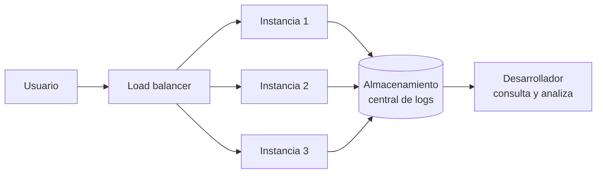

### 3.4 Librerías de logging vs. agentes de logs

Son dos piezas distintas que se complementan.

**Librerías de logging** (dentro de la aplicación): generan el log con formato, nivel y contexto.

| Lenguaje / plataforma | Librerías habituales |
|---|---|
| Java | log4j / log4j2, java.util.logging, Logback (SLF4J) |
| Ruby | Logger, Lograge |
| Node.js | Winston, Pino, Bunyan, Morgan (HTTP) |
| .NET | Serilog, NLog, log4net, `Microsoft.Extensions.Logging` |
| Python | `logging` (stdlib), structlog, integraciones de Django/Flask |
| Go | `log/slog`, zap, zerolog, Logrus |

**Agentes de logs** (fuera de la aplicación): leen, procesan y envían los logs. Por ejemplo: Fluent Bit, Fluentd, Vector, Logstash, Filebeat, el agente de CloudWatch o el propio OpenTelemetry Collector (receiver `filelog`).

Beneficios de usar un agente:
- **Agregar** logs de múltiples fuentes (apps, sistema operativo, proxies) con una sola herramienta escalable.
- **Instalación simple**, y actualizar el agente no afecta a la aplicación.
- **Buffering** y envío asíncrono y multihilo: la app no se frena si el backend está lento.
- **Parsear, enriquecer e indexar** los datos a medida que se ingieren.
- **Agnósticos de plataforma**: podés cambiar el destino sin tocar la app.

> **Relación con OpenTelemetry**: OTel no reemplaza a tu librería de logging. Se conecta con ella mediante *log bridges* (appenders para Logback o Serilog, instrumentación de Winston, etc.), que agregan `trace_id`/`span_id` y envían los logs por OTLP. También puede leer archivos con el Collector.

### 3.5 Elastic Stack (ELK)

El stack clásico de logs centralizados:

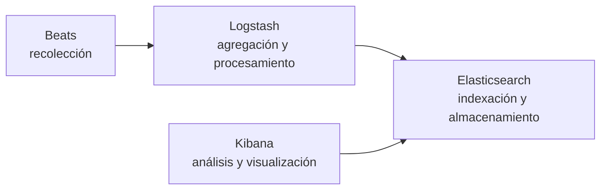

| Componente | Rol |
|---|---|
| **Beats** (Filebeat, Metricbeat…) | Agentes livianos que recolectan datos en cada origen |
| **Logstash** | Parsea, transforma y enriquece (por ejemplo, con filtros *grok*) |
| **Elasticsearch** | Motor de búsqueda e indexación; escala horizontalmente |
| **Kibana** | Búsqueda, dashboards y visualización |

Hoy Elastic lo presenta como **Elastic Observability**, con soporte nativo de OTLP. Existe además **OpenSearch**, el fork open source mantenido por AWS (*Amazon OpenSearch Service*).

### 3.6 Análisis de logs

Centralizar sirve para **consultar**: filtrar por campos, agrupar, detectar patrones y armar gráficos a partir de logs.

En AWS:
- **CloudWatch Logs**: almacenamiento centralizado con *log groups* y *log streams*, retención configurable (de un día a nunca expirar), *metric filters* para convertir patrones de log en métricas y alarmas, y *subscription filters* para enviar logs a otros destinos.
- **CloudWatch Logs Insights**: lenguaje de consulta interactivo. Ejemplo:

  ```
  fields @timestamp, level, message, order_id
  | filter level = "error"
  | stats count(*) as errores by bin(5m)
  | sort errores desc
  ```

- **Elastic Beanstalk**: permite ver los logs de las instancias desde la consola, rotarlos a S3 o enviarlos en streaming a CloudWatch Logs.

Otras herramientas de análisis: Kibana, Grafana (con Loki), Splunk, Datadog Log Management, New Relic Logs.

---

## 4. APM, métricas y métricas custom

### 4.1 ¿Qué es APM?

**APM (*Application Performance Monitoring*)** es el conjunto de herramientas y procesos para monitorear y optimizar el rendimiento de las aplicaciones. Busca **detectar anomalías, reducir la latencia y mejorar la experiencia del usuario**, y también **diagnosticar problemas** como cuellos de botella o bugs que afectan el rendimiento.

Un chiste recurrente describe bien el ciclo de adopción: al principio el equipo pregunta qué es esa herramienta "mágica" que mide todo; dos años después quiere *medir absolutamente todo*. El desafío no es juntar datos, sino juntar los datos correctos.

### 4.2 ¿Qué mide un APM?

| Medida | Qué es | Ejemplo |
|---|---|---|
| **Throughput** | Requests por unidad de tiempo | 1.200 rpm |
| **Response time** | Latencia (promedio y percentiles) | p50 = 80 ms, p99 = 900 ms |
| **Error rate** | Porcentaje de requests con error | 0,4 % |
| **Infraestructura** | CPU, RAM, disco, red de los hosts o contenedores | CPU 65 % |
| **Traces** | Recorrido de requests individuales | Ver sección 5 |
| **Y más** | Dependencias externas, queries lentas, deployments, Apdex, *service map* | — |

> **Usar percentiles, no promedios.** Un promedio de 100 ms puede esconder que 1 de cada 100 usuarios espera 5 segundos. El p95/p99 muestra la experiencia de los usuarios más afectados.

Herramientas APM: New Relic, Datadog, Dynatrace, Splunk Observability, Elastic APM, Grafana (Application Observability), **Apache SkyWalking** (open source), AWS CloudWatch Application Signals.

### 4.3 Métricas custom

Además de las métricas que ya envía el agente del APM, **podemos enviar las nuestras**. Esto permite armar dashboards sobre **métricas del sistema o del negocio**, que suelen ser las más valiosas para la organización:

- Órdenes creadas por minuto
- Tasa de conversión del checkout
- Monto facturado por medio de pago
- Pagos rechazados por la pasarela
- Usuarios activos

Un dashboard ejecutivo de e-commerce puede mostrar ingresos en riesgo por errores de pago, porcentaje de compras exitosas, volumen de órdenes y valor por cliente. **Es la misma infraestructura de observabilidad al servicio del negocio.**

Ejemplo del práctico (`apps/booking-service/src/bookings.metrics.ts` y `bookings.service.ts`), con la API de métricas de OpenTelemetry:

```typescript
import { metrics } from '@opentelemetry/api';

const meter = metrics.getMeter('tickets.booking-service');

export const bookingsCreatedCounter = meter.createCounter('bookings.created', {
  description: 'Cantidad de bookings creados',
  unit: '{booking}',
});
export const bookingsRevenueCounter = meter.createCounter('bookings.total_amount', {
  description: 'Monto total facturado en bookings creados',
  unit: 'ARS',
});
export const bookingCreationDuration = meter.createHistogram('bookings.creation.duration', {
  description: 'Duración de la creación de un booking end-to-end',
  unit: 'ms',
});

// En BookingsService.create(), cuando la reserva se guardó:
const attrs = { event_id: input.eventId, status: 'CONFIRMED' };
bookingsCreatedCounter.add(1, attrs);
bookingsRevenueCounter.add(booking.totalAmount, attrs);
// ...y en el finally, siempre:
bookingCreationDuration.record(performance.now() - startedAt, { event_id: input.eventId, status });
```

> Los atributos (`event_id`, `status`) tienen que ser de **baja cardinalidad**. Nunca `bookingId`, `customerEmail` ni `user_id` como atributo de una métrica. La sección 21.4 explica cómo quedan estos nombres en Prometheus y las decisiones de diseño.

Con el agente de New Relic, la alternativa propietaria es `newrelic.recordMetric()` o `newrelic.recordCustomEvent()`, consultables con **NRQL**. El ejemplo de OpenTelemetry hace lo mismo sin atarse al proveedor.

### 4.4 Alarmas

Recolectar datos no sirve de nada si nadie se entera cuando algo sale mal. Toda estrategia de observabilidad termina en **alarmas**: CloudWatch Alarms, alertas de Grafana, *alert conditions* de New Relic, monitores de Datadog. Los criterios para diseñarlas bien están en la sección de buenas prácticas.

---

## 5. Distributed tracing: conceptos básicos

**Distributed tracing** es la capacidad de seguir y observar las requests de un servicio a otro a medida que atraviesan un sistema distribuido.

### 5.1 Request, trace y span

| Concepto | Definición |
|---|---|
| **Request** | La operación que dispara el usuario o un sistema (por ejemplo, `POST /checkout`) |
| **Trace** | El registro completo de esa request a través de todos los servicios que tocó. Se identifica con un `trace_id`. |
| **Span** | Una unidad de trabajo dentro de la traza: una llamada HTTP, una query, una función. Tiene `span_id`, inicio, duración y atributos. |
| **Root span** | El primer span de la traza; no tiene padre |
| **Relación padre-hijo** | Cada span sabe quién lo originó, y así se arma el árbol |

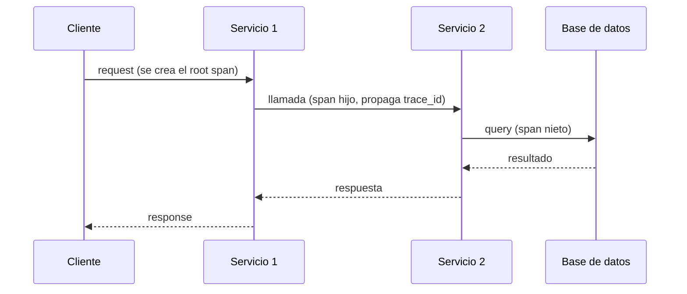

### 5.2 Visualización en el tiempo: waterfall y flame graph

Las herramientas muestran la traza como barras horizontales en el eje del tiempo. Cada barra es un span y su largo es su duración. Las barras hijas quedan anidadas dentro de las del padre.

Ejemplo (basado en el ejemplo de Datadog de la presentación): una request "usar cupón".

```
TIEMPO ──────────────────────────────────────────────────────────►
[USE COUPON REQUEST ........................................] trace 123
  [API: USER AUTH ....]
                     [API: FRAUD CHECK]
                                  [API: APPLY COUPON .........................]
                                    [FUNCTION: PROCESS COUPON ......]
                                                    [DATABASE: STORE COUPON ...]
```

Leerla es directo: se ve qué parte es secuencial, qué parte es paralela y cuál es la barra más larga, o sea el cuello de botella.

### 5.3 Propagación de contexto

Para que los spans de distintos servicios formen una misma traza, el `trace_id` tiene que **viajar con la request**. El estándar es el header W3C `traceparent`:

```
traceparent: 00-4bf92f3577b34da6a3ce929d0e0e4736-00f067aa0ba902b7-01
             │  │                                │                │
          versión        trace_id                   span_id padre   flags (sampled)
```

La instrumentación automática de OpenTelemetry inyecta y lee este header sola en HTTP y gRPC. En colas y mensajería (SQS, Kafka, SNS) hay que asegurarse de propagarlo en los atributos del mensaje.

> **Origen histórico**: el tracing distribuido moderno viene del paper de Google sobre **Dapper** (2010), que inspiró a Zipkin (Twitter), Jaeger (Uber) y, finalmente, a OpenTracing/OpenCensus y OpenTelemetry.

---

## 6. Las tres capas de un stack de observabilidad

Casi toda la confusión entre herramientas se resuelve separando responsabilidades:

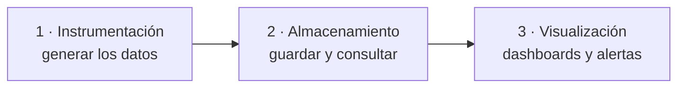

| Capa | Responsabilidad | Ejemplos |
|---|---|---|
| **Instrumentación y recolección** | Generar telemetría y transportarla | OpenTelemetry (SDK + Collector), agentes propietarios |
| **Almacenamiento (backend)** | Guardar, indexar y consultar | Prometheus, Mimir, Tempo, Loki, Jaeger, Elasticsearch, X-Ray, CloudWatch |
| **Visualización y alertas** | Mostrar, explorar, alertar | Grafana, Kibana, consolas de AWS |

**Plataformas todo en uno** (New Relic, Datadog, Dynatrace) cubren las tres capas en un solo producto.

> **Idea central**: OpenTelemetry y Grafana **no compiten**. Uno genera los datos, el otro los muestra. En el medio hay un backend.

---

## 7. OpenTelemetry en profundidad

### ¿Qué es?

**OpenTelemetry (OTel)** es un proyecto de la CNCF (Cloud Native Computing Foundation) que define un **estándar abierto** para generar, recolectar y exportar telemetría. Nació en 2019 de la fusión de dos proyectos previos: OpenTracing y OpenCensus.

Es **agnóstico al proveedor**: instrumentás una vez y mandás los datos a donde quieras.

> OpenTelemetry **no** es un backend ni una herramienta de visualización. No guarda ni muestra datos.

### Componentes

| Componente | Qué hace |
|---|---|
| **API** | Interfaces para crear spans, métricas y logs desde el código. Es lo que usa tu código de negocio. |
| **SDK** | Implementación de la API: sampling, procesamiento, exportación. Se configura al arrancar la app. |
| **Instrumentación automática** | Librerías/agentes que enganchan frameworks comunes (HTTP, bases de datos, colas) sin tocar código. |
| **OTLP** | *OpenTelemetry Protocol*: el protocolo estándar de transporte. Puerto **4317** (gRPC) y **4318** (HTTP). |
| **Collector** | Proceso independiente que recibe, procesa y reenvía telemetría. |
| **Convenciones semánticas** | Nombres estándar para atributos: `http.request.method`, `db.system`, `service.name`, etc. Permiten que cualquier backend entienda los datos. |

### Instrumentación automática vs. manual

**Automática**
- Agregás el agente/SDK como dependencia y listo.
- Obtenés trazas de requests HTTP entrantes y salientes, queries a base de datos, llamadas a colas.
- Ideal para arrancar: cero cambios de código.

**Manual**
- Creás spans y atributos vos mismo en el código.
- Te da detalle de **lógica de negocio**: "validar stock", "calcular descuento", "monto del pago".

**En la práctica se usan las dos**: la automática da la base, la manual agrega lo que importa al negocio.

Ejemplo de instrumentación manual en TypeScript (Node.js):

```typescript
import { trace, SpanStatusCode } from '@opentelemetry/api';

const tracer = trace.getTracer('checkout');

async function procesarPago(orden: Orden) {
  return tracer.startActiveSpan('procesar_pago', async (span) => {
    span.setAttribute('orden.id', orden.id);
    span.setAttribute('pago.monto', orden.total);
    span.setAttribute('pago.medio', orden.medioPago);
    try {
      const resultado = await pasarela.cobrar(orden);
      span.setAttribute('pago.aprobado', resultado.aprobado);
      return resultado;
    } catch (e) {
      span.recordException(e as Error);
      span.setStatus({ code: SpanStatusCode.ERROR });
      throw e;
    } finally {
      span.end();   // en JS el span se cierra explícitamente
    }
  });
}
```

### El Collector

El Collector es la pieza que desacopla la aplicación del destino final. Su configuración tiene tres bloques principales, unidos por **pipelines**:

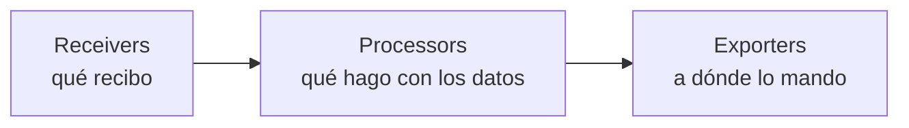

| Bloque | Ejemplos |
|---|---|
| **Receivers** | `otlp`, `prometheus`, `filelog`, `awsecscontainermetrics` |
| **Processors** | `batch`, `memory_limiter`, `resourcedetection`, `attributes`, `filter`, `tail_sampling` |
| **Exporters** | `otlp`, `otlphttp`, `prometheusremotewrite`, `awsxray`, `awsemf`, `debug` |

**¿Por qué usar un Collector y no exportar directo desde la app?**
- La app se desentiende de reintentos, batching y autenticación con el backend.
- Cambiar de backend es cambiar **configuración**, no código.
- Podés filtrar datos sensibles, enriquecer con metadatos y hacer sampling en un solo lugar.
- Podés exportar a **varios backends a la vez** (por ejemplo, durante una migración).

### Patrones de despliegue del Collector

| Patrón | Descripción | Cuándo |
|---|---|---|
| **Sidecar / agente** | Un Collector al lado de cada app (misma task/pod) | Simple, aislado, baja latencia de red |
| **Daemon / por nodo** | Un Collector por host | EC2, Kubernetes con DaemonSet |
| **Gateway** | Un clúster central de Collectors | Tail sampling, políticas centralizadas, control de salida |
| **Agente + gateway** | Sidecars que reenvían a un gateway | Arquitecturas grandes: lo más común a escala |

---

## 8. Grafana y el stack abierto

**Grafana** es una herramienta de **visualización y alertas**. Se conecta a múltiples fuentes de datos (*data sources*) y las muestra en dashboards. No genera ni almacena telemetría por sí misma.

### El stack "LGTM" de Grafana Labs

| Letra | Proyecto | Señal |
|---|---|---|
| **L** | Loki | Logs |
| **G** | Grafana | Visualización |
| **T** | Tempo | Trazas |
| **M** | Mimir (o Prometheus) | Métricas |

Otras piezas frecuentes: **Pyroscope** (profiling), **Alloy** (distribución del Collector de Grafana Labs).

### Opciones de hosting

- **Self-hosted**: lo corrés vos. Control total, costo de operación alto.
- **Grafana Cloud**: SaaS de Grafana Labs.
- **Servicios gestionados de AWS**: *Amazon Managed Grafana* y *Amazon Managed Service for Prometheus*.

### Fortalezas

- Open source y sin lock-in.
- Muy flexible: combina fuentes (Prometheus, CloudWatch, SQL, Elasticsearch…) en un mismo dashboard.
- Correlación entre señales (de una métrica a una traza con *exemplars*, de una traza a sus logs).

---

## 9. Plataformas todo en uno

**New Relic, Datadog, Dynatrace, Honeycomb, Elastic Observability**, entre otras, ofrecen las tres capas integradas como servicio.

### Ventajas
- **Time-to-value muy corto**: instalás un agente y en minutos tenés dashboards.
- **Sin infraestructura que operar**.
- **Funciones avanzadas listas**: detección de anomalías, mapas de servicios, análisis de causa raíz asistido por IA, APM, monitoreo de usuario real (RUM), sintéticos.
- Soporte comercial.

### Desventajas
- **Costo**: suele cobrarse por volumen ingerido, hosts o usuarios, y puede crecer de forma no lineal al escalar.
- **Vendor lock-in** si instrumentás con el agente propietario.
- Menos control sobre retención y dónde viven los datos.

### El punto de encuentro

Todas estas plataformas **aceptan OTLP**. Entonces podés instrumentar con OpenTelemetry y usarlas **solo como backend + visualización**. Si mañana te querés ir, cambiás el exporter del Collector.

---

## 10. Comparación: armar el stack vs. comprarlo

| Criterio | Stack abierto (OTel + Grafana LGTM) | Plataforma comercial (New Relic, Datadog…) | Nativo AWS (OTel/ADOT + X-Ray + CloudWatch) |
|---|---|---|---|
| Arranque | Lento | Muy rápido | Medio |
| Costo de licencia | Nulo (self-hosted) | Alto, crece con el volumen | Por uso |
| Costo de operación | Alto (tu equipo) | Bajo | Bajo |
| Control y flexibilidad | Total | Limitado | Medio |
| Lock-in | Ninguno | Alto si usás agentes propietarios | Medio |
| Funciones "inteligentes" | Hay que armarlas | Incluidas | Algunas incluidas |
| Multi-nube | Sí | Sí | Pensado para AWS |

### Heurística para decidir

- **Startup o equipo chico sin equipo de plataforma** → plataforma comercial, pero instrumentando con OTel.
- **Empresa grande con alto volumen** → stack abierto o híbrido: el costo de licencia a escala suele justificar un equipo de plataforma.
- **Todo en AWS y necesidades moderadas** → nativo AWS con ADOT.

> **Costo oculto**: "gratis" no existe. El stack abierto no tiene licencia, pero sí horas de ingeniería para operarlo, actualizarlo y escalarlo.

---

## 11. Caso de estudio: el checkout lento

**Escenario**: tienda online en microservicios. Los usuarios reportan que el checkout está lento.

**Sin observabilidad**: se revisan logs sueltos de cada servicio, se reinicia algo "por las dudas", se adivina.

**Con observabilidad**:

1. **Métrica (el qué)** — El dashboard de Grafana muestra que la latencia p99 de `POST /checkout` subió de 200 ms a 2 s a partir de las 14:05.

2. **Traza (el dónde)** — Desde el pico del gráfico se salta a una traza de ejemplo (*exemplar*):

   ```
   POST /checkout ................................. 2010 ms
   ├── carrito-service: obtener_carrito ........... 35 ms
   ├── usuarios-service: validar_usuario .......... 20 ms
   └── pagos-service: procesar_pago ............... 1850 ms
       ├── HTTP POST pasarela-externa (intento 1) . 600 ms  ✖ timeout
       ├── HTTP POST pasarela-externa (intento 2) . 600 ms  ✖ timeout
       └── HTTP POST pasarela-externa (intento 3) . 600 ms  ✖ timeout
   ```

3. **Logs (el porqué)** — Filtrando por el `trace_id` de esa traza en los logs del servicio de pagos:

   ```json
   {"level":"warn","service":"pagos","trace_id":"4bf92f3577b34da6...","msg":"Reintentos agotados contra pasarela externa","intentos":3,"timeout_ms":600}
   ```

**Diagnóstico**: la pasarela externa está degradada y nuestra política de reintentos (3 reintentos sin *backoff* ni *circuit breaker*) amplifica el problema.

**Lecciones para arquitectura**:
- Timeouts y reintentos son decisiones de diseño con impacto directo en la latencia percibida.
- Patrones como *circuit breaker* y *exponential backoff with jitter* mitigan esto.
- Sin trazas distribuidas, este diagnóstico podría llevar horas.

---

## 12. De punta a punta en AWS ECS

### Arquitectura objetivo

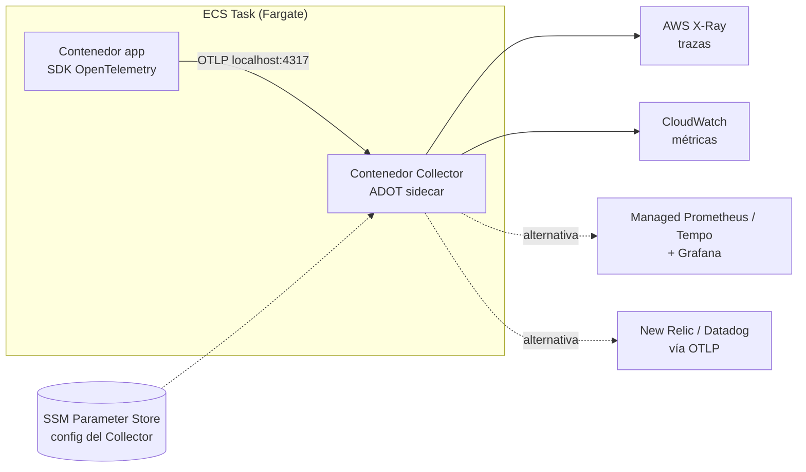

### Paso 1 — Instrumentar la aplicación

Ejemplo con Node.js / NestJS, igual que en el práctico del curso (sección 21). La inicialización vive en una librería compartida y se ejecuta **antes** de cargar el framework:

```typescript
// libs/observability/src/index.ts (resumido del repo del práctico)
import { NodeSDK } from '@opentelemetry/sdk-node';
import { resourceFromAttributes } from '@opentelemetry/resources';
import { ATTR_SERVICE_NAME } from '@opentelemetry/semantic-conventions';
import { BatchSpanProcessor } from '@opentelemetry/sdk-trace-base';
import { OTLPTraceExporter } from '@opentelemetry/exporter-trace-otlp-grpc';
import { HttpInstrumentation } from '@opentelemetry/instrumentation-http';
import { UndiciInstrumentation } from '@opentelemetry/instrumentation-undici';
import { NestInstrumentation } from '@opentelemetry/instrumentation-nestjs-core';

export function initObservability(opts: { serviceName: string }) {
  const sdk = new NodeSDK({
    resource: resourceFromAttributes({ [ATTR_SERVICE_NAME]: opts.serviceName }),
    spanProcessors: [new BatchSpanProcessor(new OTLPTraceExporter())], // lee OTEL_EXPORTER_OTLP_ENDPOINT
    instrumentations: [new HttpInstrumentation(), new UndiciInstrumentation(), new NestInstrumentation()],
  });
  sdk.start();
}
```

```typescript
// apps/booking-service/src/bootstrap.ts
import { initObservability } from '@tickets/observability';
initObservability({ serviceName: 'booking-service' });
```

```bash
# package.json → "start": se precarga bootstrap.js antes que la app
node -r ./dist/bootstrap.js dist/main.js
```

La alternativa sin código es `@opentelemetry/auto-instrumentations-node` con `node --require @opentelemetry/auto-instrumentations-node/register app.js`. En Python, lo equivalente es `opentelemetry-instrument python app.py`.

La configuración se hace por **variables de entorno estándar** (iguales en todos los lenguajes):

| Variable | Ejemplo | Para qué |
|---|---|---|
| `OTEL_SERVICE_NAME` | `checkout-service` | Nombre del servicio en trazas y métricas |
| `OTEL_EXPORTER_OTLP_ENDPOINT` | `http://localhost:4317` | A dónde mandar (el sidecar) |
| `OTEL_EXPORTER_OTLP_PROTOCOL` | `grpc` | Protocolo OTLP |
| `OTEL_RESOURCE_ATTRIBUTES` | `deployment.environment=prod,service.version=1.4.2` | Metadatos del recurso |
| `OTEL_TRACES_SAMPLER` | `parentbased_traceidratio` | Estrategia de sampling |
| `OTEL_TRACES_SAMPLER_ARG` | `0.1` | 10% de las trazas |
| `OTEL_PROPAGATORS` | `tracecontext,baggage` | Formato de propagación de contexto |

> Otros lenguajes siguen la misma idea: en Java un `-javaagent`, en Python `opentelemetry-instrument`, en .NET la auto-instrumentación de OpenTelemetry .NET.

### Paso 2 — Configurar el Collector

Se usa **ADOT** (*AWS Distro for OpenTelemetry*): el Collector de OpenTelemetry empaquetado y soportado por AWS, con los exporters de AWS incluidos.

**Configuración del Collector** (guardada en SSM Parameter Store, por ejemplo `/otel/checkout/collector-config`):

```yaml
extensions:
  health_check:

receivers:
  otlp:
    protocols:
      grpc:
        endpoint: 0.0.0.0:4317
      http:
        endpoint: 0.0.0.0:4318

processors:
  # Protege al collector de quedarse sin memoria
  memory_limiter:
    check_interval: 1s
    limit_percentage: 80
    spike_limit_percentage: 25
  # Agrega metadatos de ECS (cluster, task, etc.) a toda la telemetría
  resourcedetection:
    detectors: [env, ecs]
  # Agrupa envíos para reducir llamadas de red
  batch:
    timeout: 5s

exporters:
  awsxray:
    region: us-east-1
  awsemf:
    region: us-east-1
    namespace: Checkout
    log_group_name: /aws/otel/checkout
  # Útil para depurar: imprime la telemetría en los logs del contenedor
  debug:
    verbosity: basic

service:
  extensions: [health_check]
  pipelines:
    traces:
      receivers: [otlp]
      processors: [memory_limiter, resourcedetection, batch]
      exporters: [awsxray]
    metrics:
      receivers: [otlp]
      processors: [memory_limiter, resourcedetection, batch]
      exporters: [awsemf]
```

> **Orden de processors**: `memory_limiter` va primero y `batch` al final. Es la recomendación oficial.

**Alternativa: stack abierto con Grafana** — solo cambian los exporters:

```yaml
extensions:
  sigv4auth:
    region: us-east-1
    service: aps

exporters:
  prometheusremotewrite:
    endpoint: https://aps-workspaces.us-east-1.amazonaws.com/workspaces/ws-XXXX/api/v1/remote_write
    auth:
      authenticator: sigv4auth
  otlp/tempo:
    endpoint: tempo.interno:4317
    tls:
      insecure: true
```

**Alternativa: plataforma comercial** — un exporter OTLP con la API key:

```yaml
exporters:
  otlphttp/newrelic:
    endpoint: https://otlp.nr-data.net
    headers:
      api-key: ${env:NEW_RELIC_LICENSE_KEY}
```

> **Este es el beneficio central de OpenTelemetry**: cambiar de X-Ray a Grafana o a New Relic es cambiar el bloque `exporters`. El código de la aplicación no se toca.

### Paso 3 — La task definition con el sidecar

```json
{
  "family": "checkout-service",
  "requiresCompatibilities": ["FARGATE"],
  "networkMode": "awsvpc",
  "cpu": "512",
  "memory": "1024",
  "executionRoleArn": "arn:aws:iam::123456789012:role/checkoutTaskExecutionRole",
  "taskRoleArn": "arn:aws:iam::123456789012:role/checkoutTaskRole",
  "containerDefinitions": [
    {
      "name": "aws-otel-collector",
      "image": "public.ecr.aws/aws-observability/aws-otel-collector:latest",
      "essential": true,
      "secrets": [
        {
          "name": "AOT_CONFIG_CONTENT",
          "valueFrom": "arn:aws:ssm:us-east-1:123456789012:parameter/otel/checkout/collector-config"
        }
      ],
      "logConfiguration": {
        "logDriver": "awslogs",
        "options": {
          "awslogs-group": "/ecs/checkout/otel-collector",
          "awslogs-region": "us-east-1",
          "awslogs-stream-prefix": "otel"
        }
      }
    },
    {
      "name": "checkout-app",
      "image": "123456789012.dkr.ecr.us-east-1.amazonaws.com/checkout:1.4.2",
      "essential": true,
      "portMappings": [{ "containerPort": 8080, "protocol": "tcp" }],
      "environment": [
        { "name": "OTEL_SERVICE_NAME", "value": "checkout-service" },
        { "name": "OTEL_EXPORTER_OTLP_ENDPOINT", "value": "http://localhost:4317" },
        { "name": "OTEL_EXPORTER_OTLP_PROTOCOL", "value": "grpc" },
        { "name": "OTEL_RESOURCE_ATTRIBUTES", "value": "deployment.environment=prod,service.version=1.4.2" },
        { "name": "OTEL_TRACES_SAMPLER", "value": "parentbased_traceidratio" },
        { "name": "OTEL_TRACES_SAMPLER_ARG", "value": "0.1" }
      ],
      "dependsOn": [
        { "containerName": "aws-otel-collector", "condition": "START" }
      ],
      "logConfiguration": {
        "logDriver": "awslogs",
        "options": {
          "awslogs-group": "/ecs/checkout/app",
          "awslogs-region": "us-east-1",
          "awslogs-stream-prefix": "app"
        }
      }
    }
  ]
}
```

Puntos a notar:
- `dependsOn` hace que la app arranque después del Collector, para no perder la telemetría inicial.
- `AOT_CONFIG_CONTENT` es la variable que ADOT lee para obtener su configuración; se inyecta desde SSM como *secret*.
- `essential` en el Collector es una **decisión de diseño**: en `true`, si el Collector muere se reinicia la task entera; en `false`, la app sigue funcionando sin telemetría. Buen tema para discutir en clase.

### Paso 4 — Los tres detalles que definen si funciona a la primera

#### 1. De dónde sale la configuración del Collector
La imagen sola no sabe qué recibir ni a dónde mandar. Opciones:
- **SSM Parameter Store** (lo más común con ADOT, vía `AOT_CONFIG_CONTENT`).
- Configuración empaquetada en una imagen propia derivada de la oficial.
- ADOT trae configs por defecto para ECS (por ejemplo, pasando `--config=/etc/ecs/ecs-default-config.yaml` como `command`), útiles para arrancar rápido.

#### 2. La red entre contenedores
- En **Fargate** el modo de red es siempre `awsvpc`: todos los contenedores de la task comparten la misma interfaz de red, así que se hablan por `localhost`.
- En **EC2 con modo `bridge`** no comparten localhost; hay que usar `links` o el nombre del contenedor, o pasar a `awsvpc`.

#### 3. Los permisos IAM
Hay **dos roles distintos** y es fácil confundirlos:

| Rol | Quién lo usa | Qué necesita en este caso |
|---|---|---|
| **Task execution role** | El agente de ECS, para *arrancar* la task | Bajar imágenes de ECR, escribir en CloudWatch Logs, **leer el parámetro de SSM** (`ssm:GetParameters`) |
| **Task role** | Los contenedores, *en ejecución* | Escribir en X-Ray (`xray:PutTraceSegments`, `xray:PutTelemetryRecords`, …), escribir en CloudWatch (`logs:PutLogEvents`, `cloudwatch:PutMetricData`, …) o `aps:RemoteWrite` para Managed Prometheus |

> **Ojo**: el task role es **por task, no por contenedor**. Todos los contenedores de la task (app y Collector) comparten los mismos permisos. Si querés aislar permisos, eso es un argumento para mover el Collector a un gateway separado.

Error clásico: el Collector levanta bien, no hay errores en la app, pero **no aparece nada en X-Ray**. Casi siempre es el task role sin permisos. Revisar los logs del contenedor del Collector.

### Paso 5 — Visualizar y explorar

- **Nativo AWS**: X-Ray *trace map* y *traces*; métricas en CloudWatch; CloudWatch Application Signals para vistas de servicio (SLOs, latencia, errores).
- **Grafana**: agregar Managed Prometheus, Tempo y Loki (o CloudWatch/X-Ray) como *data sources*; armar dashboards RED (ver buenas prácticas) y configurar el salto métrica → traza → logs.
- **Plataforma comercial**: los datos aparecen en su APM automáticamente al recibir OTLP con `service.name`.

### Checklist de despliegue

- [ ] SDK de OTel + instrumentación automática en la imagen de la app
- [ ] `OTEL_SERVICE_NAME` y atributos de recurso definidos
- [ ] Config del Collector en SSM
- [ ] Contenedor del Collector en la task definition
- [ ] `dependsOn` de la app hacia el Collector
- [ ] Execution role con acceso a SSM y ECR
- [ ] Task role con permisos hacia el backend elegido
- [ ] Logs del Collector enviados a CloudWatch para depuración
- [ ] Verificar trazas en el backend con una request de prueba

---

## 13. Sampling y control de costos

Guardar el 100% de las trazas de un sistema con mucho tráfico es caro e innecesario.

### Head sampling
La decisión se toma **al inicio** de la traza (en el primer servicio) y se propaga.
- ✅ Simple y barato: se configura en el SDK (`OTEL_TRACES_SAMPLER`).
- ❌ Decide antes de saber si la request va a fallar: podés descartar justo las trazas con error.

### Tail sampling
La decisión se toma **al final**, cuando la traza está completa.
- ✅ Permite reglas inteligentes: guardar el 100% de los errores, el 100% de las requests lentas, y un 5% del resto.
- ❌ Requiere que **todos los spans de una traza lleguen al mismo Collector**, que los retiene en memoria.

```yaml
processors:
  tail_sampling:
    decision_wait: 10s
    policies:
      - name: errores
        type: status_code
        status_code: { status_codes: [ERROR] }
      - name: lentas
        type: latency
        latency: { threshold_ms: 1000 }
      - name: muestra-general
        type: probabilistic
        probabilistic: { sampling_percentage: 5 }
```

> **Dato de arquitectura importante**: el tail sampling **no funciona bien en un sidecar**, porque cada sidecar solo ve los spans de su propio servicio, no la traza completa. Se resuelve con un **tier gateway**: los sidecars reenvían a un grupo de Collectors centrales, con el exporter `loadbalancing` que enruta por `trace_id` para que todos los spans de una traza caigan en la misma instancia.

### Otras palancas de costo
- **Cardinalidad** de métricas: no usar IDs únicos como etiquetas.
- **Filtrar** en el Collector: health checks, endpoints de métricas, spans ruidosos.
- **Retención** diferenciada: trazas pocos días, métricas agregadas meses.
- **Niveles de log**: `DEBUG` apagado en producción; logs con `trace_id` para no necesitar loguear de más.

---

## 14. Buenas prácticas

1. **Instrumentar con OpenTelemetry desde el día uno**, aunque el backend sea una plataforma paga. Es un seguro contra el lock-in.
2. **Usar siempre un Collector**, aunque al principio solo reenvíe. Desacopla la app del destino.
3. **Nombrar bien**: `service.name`, `service.version`, `deployment.environment` en todos los servicios. Seguir las convenciones semánticas.
4. **Correlacionar las señales**: `trace_id` en los logs, *exemplars* en las métricas.
5. **Propagación de contexto en todos lados**: HTTP, colas (SQS, Kafka), jobs asíncronos. Una traza cortada pierde la mitad del valor.
6. **Métodos de dashboards**:
   - **RED** para servicios: *Rate* (requests/s), *Errors* (tasa de error), *Duration* (latencia).
   - **USE** para recursos: *Utilization*, *Saturation*, *Errors*.
   - **Golden signals** de Google SRE: latencia, tráfico, errores, saturación.
7. **Alertar sobre síntomas, no causas**: alertar "el checkout tiene 5% de errores" (lo que siente el usuario), no "el CPU está al 85%".
8. **Definir SLOs** (*Service Level Objectives*) y alertar por consumo del *error budget*.
9. **Sampling pensado**: head sampling para arrancar; tail sampling cuando el volumen y el valor lo justifiquen.
10. **No loguear datos sensibles** (tarjetas, contraseñas, datos personales). Filtrar también en el Collector como red de seguridad.
11. **Tratar la configuración de observabilidad como código**: config del Collector, dashboards y alertas versionados en Git.
12. **Instrumentación manual con criterio**: spans en operaciones de negocio relevantes, no en cada función.

---

## 15. Antipatrones y errores clásicos

| Antipatrón | Consecuencia |
|---|---|
| Instrumentar con el agente propietario del proveedor | Reinstrumentar todo para migrar |
| `user_id` o `order_id` como etiqueta de métrica | Explosión de cardinalidad y costo |
| Guardar el 100% de las trazas | Factura enorme y poco valor extra |
| Logs en texto libre sin `trace_id` | Imposible correlacionar |
| Contexto no propagado en colas o async | Trazas partidas en pedazos |
| Alertas sobre todo | Fatiga de alertas: se ignoran las importantes |
| Dashboards con 60 gráficos | Nadie sabe dónde mirar durante un incidente |
| Olvidar los permisos IAM del Collector | "Anda todo" pero no llegan datos |
| Collector sin `memory_limiter` | El Collector se cae por OOM bajo carga |
| Observabilidad como tarea "para después" | Se agrega en medio de un incidente, tarde |

---

## 16. Desafíos de la observabilidad

La presentación original cierra con una lista de desafíos que sigue vigente:

| Desafío | Qué implica | Cómo se aborda |
|---|---|---|
| **Implementación: estándares vs. lock-in** | Instrumentar con el agente de un proveedor ata el código a ese proveedor | OpenTelemetry como capa de instrumentación |
| **Implementación: calidad** | Datos incompletos, nombres inconsistentes, trazas cortadas | Convenciones semánticas, revisión de la instrumentación como parte del *code review* |
| **Volumen de datos: consulta** | Consultar terabytes de logs o millones de spans es lento y caro | Índices, logs estructurados, métricas pre-agregadas, sampling |
| **Volumen de datos: retención** | ¿Cuánto tiempo guardar cada cosa? | Retención diferenciada por señal y por entorno; archivado en almacenamiento barato (S3) |
| **Series temporales** | Las métricas son series temporales con necesidades propias de almacenamiento | Bases especializadas: Prometheus, Mimir, InfluxDB, Timestream |
| **Agregados** | Al agregar se pierde el detalle (el promedio esconde el outlier) | Histogramas y percentiles, *exemplars* que enlazan una métrica con una traza |
| **Costos** | La observabilidad puede costar una fracción significativa de la infraestructura | Sampling, control de cardinalidad, filtrado en el Collector, revisión periódica |

---

## 17. Hacia dónde va la industria

- **OpenTelemetry como estándar de facto**: los grandes proveedores de nube y de APM lo adoptan y convergen hacia OTLP. Los SDKs y agentes propietarios tienden a quedar como capas de compatibilidad.
- **eBPF**: observar aplicaciones **a nivel del kernel**, sin modificar código ni reiniciar procesos. Útil para obtener trazas y métricas de red de servicios que no podés instrumentar. Proyectos como Grafana Beyla (donado a OpenTelemetry), Pixie y Cilium/Hubble van por este camino.
- **Profiling continuo** como cuarta señal integrada con las demás.
- **IA para operaciones (AIOps)**: detección de anomalías, correlación automática y análisis de causa raíz asistido. Agentes que, ante una alerta, recorren métricas, trazas y logs y proponen un diagnóstico.
- **Observabilidad de sistemas con LLMs**: convenciones semánticas de OpenTelemetry para IA generativa (tokens, modelo, latencia de inferencia, costo por request).
- **Pipelines de telemetría** como disciplina propia: filtrar, enriquecer y enrutar datos antes del backend para controlar costos.
- **Costo como métrica de primera clase**: *FinOps* aplicado a la observabilidad.

### What's next? Site Reliability Engineering

La observabilidad es la base de una disciplina más amplia: **SRE (Site Reliability Engineering)**, definida por Google como lo que pasa cuando se trata la operación como un problema de software. Conceptos a explorar a continuación: SLIs, SLOs y *error budgets*; *toil*; *postmortems* sin culpables; *on-call* sostenible. El punto de partida es [sre.google](https://sre.google/), con los libros disponibles gratis online (ver Bibliografía).

---

## 18. Glosario

| Término | Definición |
|---|---|
| **ADOT** | AWS Distro for OpenTelemetry: distribución de OTel soportada por AWS |
| **Agente de logs** | Proceso externo a la app que recolecta, procesa y envía logs (Fluent Bit, Filebeat, Collector) |
| **Apdex** | Índice de satisfacción del usuario basado en umbrales de tiempo de respuesta |
| **APM** | *Application Performance Monitoring* |
| **Beats / Logstash / Elasticsearch / Kibana** | Componentes del Elastic Stack (ELK) |
| **Cardinalidad** | Cantidad de combinaciones únicas de etiquetas de una métrica |
| **Collector** | Proceso de OTel que recibe, procesa y exporta telemetría |
| **Error budget** | Margen de falla permitido por un SLO (por ejemplo, 0,1 % para un SLO de 99,9 %) |
| **Exemplar** | Referencia de un punto de métrica a una traza concreta |
| **Exporter** | Componente que envía telemetría a un backend |
| **Flame graph** | Visualización de spans como barras anidadas en el tiempo |
| **Instrumentación** | Código o agente que genera telemetría |
| **Logging estructurado** | Logs con campos clave-valor (típicamente JSON) consultables por máquina |
| **Métrica custom** | Métrica definida por el equipo, usualmente de negocio |
| **Nivel de log** | Severidad de un log: TRACE, DEBUG, INFO, WARN, ERROR, FATAL |
| **NRQL** | *New Relic Query Language*, lenguaje de consulta de New Relic |
| **OTLP** | OpenTelemetry Protocol (puertos 4317 gRPC / 4318 HTTP) |
| **Percentil (p95, p99)** | Valor por debajo del cual queda ese porcentaje de las mediciones |
| **Propagación de contexto** | Pasar `trace_id`/`span_id` entre servicios (header `traceparent`) |
| **Receiver** | Componente del Collector que recibe datos |
| **Resource** | Entidad que produce la telemetría (servicio, host, contenedor) |
| **Root span** | Primer span de una traza; no tiene padre |
| **Sampling** | Decidir qué trazas se guardan |
| **Sidecar** | Contenedor auxiliar que corre junto a la app en la misma task/pod |
| **SLI / SLO** | Indicador y objetivo de nivel de servicio |
| **Span** | Unidad de trabajo dentro de una traza |
| **SRE** | *Site Reliability Engineering*: operación tratada como un problema de software |
| **Throughput** | Cantidad de requests procesadas por unidad de tiempo |
| **Traza** | Recorrido completo de una request, formado por spans |
| **Vendor lock-in** | Dependencia de un proveedor que encarece cambiarlo |

---

## 19. Preguntas para discutir en clase

1. ¿Por qué OpenTelemetry y Grafana no son alternativas entre sí? ¿Qué capa ocupa cada uno?
2. Una startup de 5 desarrolladores y una empresa con 500 microservicios: ¿qué stack recomendarías a cada una y por qué?
3. ¿Qué ventaja concreta tiene exportar vía un Collector en lugar de hacerlo directo desde el SDK?
4. En la task definition, ¿el Collector debería ser `essential: true` o `false`? Argumentar ambas posturas.
5. ¿Por qué el tail sampling no funciona bien con Collectors en modo sidecar? ¿Cómo lo resolverías?
6. Si el task role es compartido por todos los contenedores de una task, ¿qué implicancias de seguridad tiene el patrón sidecar?
7. En el caso del checkout lento, ¿qué cambios de diseño harías en el servicio de pagos? ¿Qué métricas agregarías para detectarlo antes?
8. ¿Qué información nunca debería llegar a un backend de observabilidad? ¿En qué capa lo controlarías?
9. ¿Qué problema resuelve eBPF que la instrumentación con SDK no resuelve? ¿Qué pierde?
10. En la evolución del logging distribuido, ¿por qué entrar por `ssh` a cada servidor deja de funcionar? ¿Qué cambia con contenedores y autoescalado?
11. Librería de logging vs. agente de logs: ¿qué responsabilidad tiene cada uno? ¿Se pueden usar los dos a la vez?
12. ¿Por qué un APM muestra p95/p99 además del promedio? Dar un ejemplo donde el promedio engaña.
13. Proponer tres métricas de negocio para el sistema del obligatorio. ¿Qué atributos les pondrían y cuáles evitarían por cardinalidad?
14. De la tabla de desafíos (sección 16), ¿cuál les parece el más difícil de resolver en su proyecto y por qué?
15. Mirando un flame graph, ¿cómo distinguen trabajo secuencial de trabajo paralelo? ¿Cuál optimizarían primero?

---

## 20. Herramientas del práctico

Antes de levantar el práctico conviene saber qué es cada pieza y qué papel cumple. Están agrupadas en cuatro capas: **infraestructura local**, **aplicación**, **telemetría** y **visualización**.

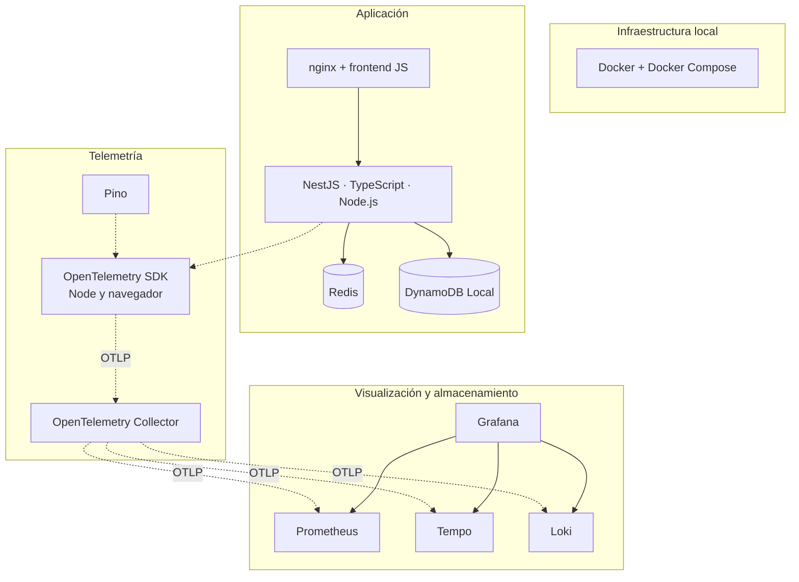

### 20.1 Infraestructura local

**Docker** empaqueta cada componente en una **imagen** y lo ejecuta como un **contenedor** aislado. Así cualquier alumno levanta el mismo entorno sin instalar Redis, Grafana ni el Collector en su máquina.

**Docker Compose** describe en un solo archivo (`docker-compose.yml`) los 7 contenedores del práctico, sus puertos, variables de entorno y dependencias. Dentro de la red de Compose, cada contenedor se alcanza por el **nombre del servicio**: por eso booking-service llama a `http://events-service:5001` y los servicios exportan a `http://otel-collector:4317`.

| Comando | Qué hace |
|---|---|
| `docker compose up --build -d` | Construye las imágenes y levanta todo en segundo plano |
| `docker compose ps` | Estado de los contenedores |
| `docker compose logs -f <servicio>` | Sigue los logs de un contenedor |
| `docker compose stop <servicio>` | Detiene un contenedor (se usa en los ejercicios) |
| `docker compose down` | Baja todo |

> **Conexión con la clase:** Compose es el equivalente local de una *task definition* de ECS. En la sección 22 se traduce una en la otra.

### 20.2 Aplicación

**Node.js** es el runtime de JavaScript del lado del servidor. El práctico usa Node 20. Un detalle que importa para observabilidad: Node trae un `fetch` nativo (implementado con la librería **undici**) que **no pasa por el módulo `http`**. Por eso necesita su propia instrumentación (ver 21.4).

**TypeScript** agrega tipos estáticos a JavaScript y se compila a JS (`tsc`) antes de ejecutar.

**NestJS** es un framework para APIs en Node.js con una arquitectura de **módulos**, **controllers** (rutas HTTP) y **providers/services** (lógica), conectados por **inyección de dependencias**. Por debajo usa Express. En el repo:

| Pieza de NestJS | Archivo | Rol |
|---|---|---|
| Module | `app.module.ts` | Declara controllers, providers y el `LoggerModule` de Pino |
| Controller | `bookings.controller.ts`, `events.controller.ts` | Rutas HTTP y validación del body con DTOs |
| Service | `bookings.service.ts`, `events.service.ts` | Lógica de negocio y acceso a datos |
| `ValidationPipe` + `class-validator` | `main.ts` y los DTOs | Rechaza con **400** los bodies inválidos (por ejemplo, `quantity` fuera de 1..10) **antes** de ejecutar la lógica |

**npm workspaces** permite tener varios paquetes en un mismo repo (monorepo). Acá hay tres: `libs/observability` (la librería compartida de OpenTelemetry), `apps/events-service` y `apps/booking-service`. Los dos servicios importan `@tickets/observability`, así la configuración de telemetría se escribe una sola vez.

**Redis** es una base de datos clave-valor en memoria, muy rápida, que se usa como cache o almacenamiento de datos efímeros. events-service guarda cada evento como un JSON bajo la clave `event:<id>`. El cliente de Node es **ioredis**.

**Amazon DynamoDB** es la base de datos NoSQL administrada de AWS: tablas con una clave de partición, sin servidores que operar y pago por uso. **DynamoDB Local** es una versión que corre en un contenedor para desarrollo, con la misma API. booking-service guarda las reservas en la tabla `Bookings` usando el **AWS SDK for JavaScript v3** (`@aws-sdk/client-dynamodb`).

**nginx** es un servidor web y proxy reverso. En el práctico:
- sirve el frontend estático (`index.html`, `app.js`, `otel.js`);
- reenvía `/api/events` y `/api/bookings` a los servicios, así el navegador no tiene problemas de CORS;
- reenvía `/otel/*` al Collector para que el navegador pueda mandar sus trazas;
- propaga el header `traceparent` (`proxy_set_header traceparent $http_traceparent`).

El frontend es **JavaScript sin framework** con **Tailwind CSS** (cargado por CDN) para los estilos.

### 20.3 Telemetría

**OpenTelemetry** (sección 7) aparece en tres lugares del práctico:

| Pieza | Paquete | Qué hace en el práctico |
|---|---|---|
| **API** | `@opentelemetry/api` | Interfaz estable para crear spans y métricas a mano (lo usa `bookings.metrics.ts`) |
| **SDK de Node** | `@opentelemetry/sdk-node` | Arranca todo: resource, procesadores y exportadores de traces, métricas y logs |
| **Instrumentaciones** | `@opentelemetry/instrumentation-*` | Generan telemetría automáticamente para HTTP, NestJS, ioredis, AWS SDK, runtime de Node y Pino |
| **Exportadores OTLP** | `@opentelemetry/exporter-*-otlp-grpc` | Mandan traces, métricas y logs al Collector por gRPC (puerto 4317) |
| **SDK del navegador** | `@opentelemetry/sdk-trace-web` + `instrumentation-fetch` | Crea un span por cada `fetch` del frontend e inyecta `traceparent` |
| **Convenciones semánticas** | `@opentelemetry/semantic-conventions` | Nombres estándar de atributos y métricas (`service.name`, `http.route`, `http.server.request.duration`) |

Versiones del repo: **SDK 2.x** (paquetes estables `2.11`, experimentales `0.222`).

**OpenTelemetry Collector** (sección 7) recibe OTLP de los servicios y del navegador, agrega metadatos y lo reenvía a Grafana LGTM. El práctico usa la distribución **contrib** (`otel/opentelemetry-collector-contrib`), que trae todos los componentes de la comunidad. Su configuración está en `otel-collector-config.yaml`.

**Pino** es una librería de logging para Node.js que escribe **logs estructurados en JSON** y está pensada para tener muy poco overhead. Se integra a NestJS con **nestjs-pino** (reemplaza el logger de Nest) y **pino-http** (un log por cada request HTTP, con método, ruta, status y duración). La **instrumentación de Pino** de OpenTelemetry cumple dos funciones: le agrega `trace_id` y `span_id` a cada log, y lo envía como *log record* de OTel al Collector. Es un ejemplo concreto de *log bridge* (sección 3.4).

### 20.4 Visualización y almacenamiento: Grafana LGTM

La imagen **`grafana/otel-lgtm`** junta el stack de la sección 8 en un solo contenedor pensado para desarrollo y demos. No es para producción: no persiste datos ni escala.

| Componente | Señal | Qué es | Lenguaje de consulta |
|---|---|---|---|
| **Prometheus** | Métricas | Base de series temporales. En LGTM recibe las métricas por OTLP directamente. | **PromQL** |
| **Tempo** | Trazas | Backend de trazas distribuidas, barato porque indexa poco y guarda en bloques | **TraceQL** |
| **Loki** | Logs | Backend de logs que indexa solo las **labels** (por ejemplo `service_name`), no el texto completo | **LogQL** |
| **Grafana** | — | Visualización: dashboards, Explore y correlación entre las tres fuentes | — |

La imagen ya trae los *data sources* configurados y **enlazados entre sí**. Por eso funcionan solos el botón *Logs for this span* (de Tempo a Loki) y el `trace_id` clickeable en los logs (de Loki a Tempo).

Los dashboards del práctico se cargan con **provisioning**: Grafana lee al arrancar los archivos de `grafana/provisioning/dashboards/` y los JSON de `grafana/dashboards/`. Son dashboards como código, versionados en Git.

#### Mínimo de los lenguajes de consulta

**PromQL (métricas)**

```promql
# Requests por segundo, por servicio
sum by (service_name) (rate(http_server_request_duration_seconds_count[5m]))

# Latencia p95 a partir del histograma
histogram_quantile(0.95,
  sum by (le) (rate(http_server_request_duration_seconds_bucket{service_name="booking-service"}[5m])))

# Reservas creadas en los últimos 15 minutos
sum(increase(bookings_created_total[15m]))
```

- `rate(x[5m])`: cuánto crece por segundo un *counter*, en promedio, en la ventana.
- `increase(x[15m])`: cuánto creció en total en la ventana.
- `sum by (label)`: agrega series y conserva la label indicada.
- `histogram_quantile(q, ...)`: calcula un percentil a partir de los *buckets* (`_bucket`, con la label `le`).

**LogQL (logs)**

```logql
{service_name="booking-service"}                          # todos los logs del servicio
{service_name="booking-service"} |= "Booking"             # que contengan el texto
{service_name="events-service"} | severity_text="warn"     # filtrar por nivel (metadato del log OTLP)
sum by (service_name) (count_over_time({service_name=~".+"}[1m]))   # volumen de logs
```

**TraceQL (trazas)**

```traceql
{ resource.service.name = "booking-service" }                         # trazas que pasan por el servicio
{ span.http.response.status_code >= 500 }                             # spans con error de servidor
{ resource.service.name = "events-service" && duration > 200ms }      # spans lentos
```

### 20.5 Herramientas auxiliares

| Herramienta | Uso en el práctico |
|---|---|
| **curl** | Llamar a las APIs desde la terminal |
| **`scripts/load.sh`** | Generador de carga en bash: lista eventos, pide detalles y crea reservas al azar cada 200 ms |
| **Grafana Cloud** (opcional) | La versión SaaS de Grafana con Prometheus, Loki y Tempo. El plan free alcanza para el práctico. Recibe OTLP por HTTPS con autenticación básica. |

### 20.6 Glosario rápido del práctico

| Término | En el práctico |
|---|---|
| **Resource** | `service.name`, `service.version` y `deployment.environment.name`, definidos en `initObservability()` |
| **Preload (`node -r`)** | Cómo se carga OpenTelemetry antes que la aplicación (ver 21.4) |
| **Monkey-patching** | Técnica que usan las instrumentaciones: reemplazan funciones de las librerías (por ejemplo `http.request`) por versiones que crean spans |
| **Batch processor** | Junta spans y logs y los manda en lotes para no hacer una llamada de red por cada uno |
| **Metric reader periódico** | Exporta las métricas acumuladas cada 10 segundos |
| **Label** | Dimensión de una métrica o de un log en Prometheus y Loki (`service_name`, `http_route`, `event_id`) |

---

## 21. Práctico: tickets-observability-node

**Repo:** https://github.com/IngSoft-ASP-2023-2/tickets-observability-node

Es un port a **Node.js / NestJS** del práctico original en .NET ([nfornaro/tickets-observability](https://github.com/nfornaro/tickets-observability)), con los mismos servicios, endpoints y telemetría. Todo corre local con `docker compose` y se visualiza en Grafana. No hace falta una cuenta de AWS ni de ningún proveedor. Las herramientas están explicadas en la sección 20.

### En resumen: cómo va a ser el práctico

**Objetivo:** ver en un sistema real las tres señales de la clase (trazas, métricas y logs), cómo se relacionan entre sí, y comprobar que con OpenTelemetry el destino de los datos es configuración y no código.

**Qué vamos a hacer, en cuatro momentos:**

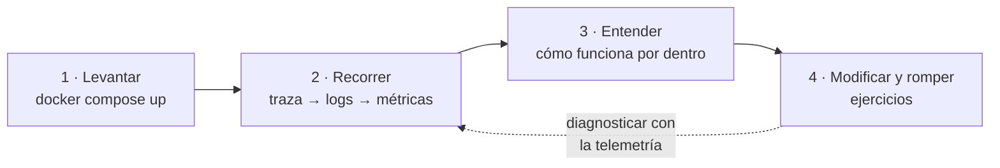

Y lo que se observa en cada paso, sobre el sistema del práctico:

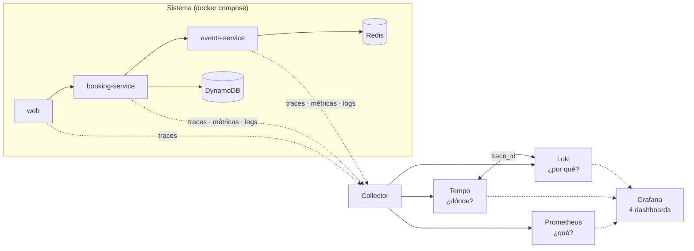

1. **Levantar el sistema** con un solo `docker compose up`: dos microservicios, un frontend, Redis, DynamoDB Local, el Collector y Grafana (21.5).
2. **Recorrerlo con la telemetría** (21.6). Hacer una reserva y seguirla de punta a punta: la traza del navegador a los servicios, sus logs, las métricas técnicas bajo carga y las métricas de negocio.
3. **Entender cómo funciona por dentro** (21.4). Cómo se carga OpenTelemetry, cómo viaja el contexto entre servicios, cómo llegan los datos a Grafana y por qué las métricas cambian de nombre.
4. **Modificar y romper** (21.7). Extender las métricas de negocio, agregar un span manual, apagar servicios y ver cómo lo cuenta la telemetría, meter latencia y cambiar el destino de los datos.

**Qué se entrega:** capturas de una traza con el span manual y del panel nuevo, y un párrafo por cada caso de "romper a propósito" explicando cómo se diagnosticó.

**Qué se necesita:** Docker y Docker Compose. No hace falta ninguna cuenta de AWS ni de otro proveedor. Grafana Cloud es opcional, para el ejercicio 6.

**Qué debería quedar claro al terminar:**
- Una traza muestra *dónde*, una métrica *qué* y un log *por qué*, y el `trace_id` las une.
- La instrumentación se escribe una vez; el destino es configuración del Collector.
- Las decisiones de instrumentación (qué medir, con qué atributos, qué cuenta como error) son decisiones de diseño.

### 21.1 El sistema

Un sistema de venta de entradas con dos microservicios que se hablan por HTTP, más un frontend instrumentado:

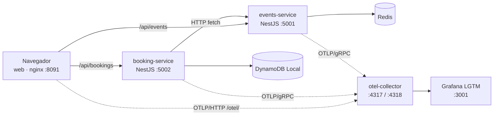

| Contenedor | Puerto host | Rol |
|---|---|---|
| `web` | 8091 | nginx con el frontend; hace proxy de `/api/*` a los servicios y de `/otel/*` al Collector |
| `booking-service` | 5002 | Reservas. `POST /bookings` llama a events-service y persiste en DynamoDB |
| `events-service` | 5001 | Catálogo de eventos en Redis (4 eventos de seed) y reserva de cupos |
| `redis` | 6379 | Almacenamiento de eventos |
| `dynamodb-local` | 8000 | Tabla `Bookings` (en memoria) |
| `otel-collector` | 4317, 4318 | Recibe OTLP y reenvía a LGTM |
| `lgtm` | 3001 | Grafana + Loki + Tempo + Prometheus |

**Endpoints**

| Servicio | Método y ruta | Body |
|---|---|---|
| events-service | `GET /events` | — |
| events-service | `GET /events/:id` | — |
| events-service | `POST /events/:id/reservations` | `{ "quantity": 1..10 }` |
| booking-service | `POST /bookings` | `{ "eventId": "e1", "customerEmail": "a@b.com", "quantity": 2 }` |
| booking-service | `GET /bookings/:id` | — |

**Flujo de `POST /bookings`**

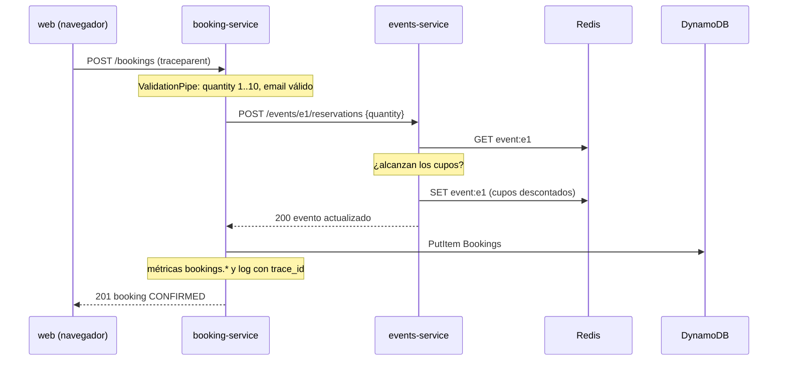

### 21.2 Dónde está cada concepto de la clase en el repo

| Concepto (sección del doc) | Dónde verlo en el repo |
|---|---|
| Instrumentación automática (7) | `libs/observability/src/index.ts`: `NodeSDK` con instrumentaciones de HTTP, NestJS, ioredis, AWS SDK, runtime de Node y Pino |
| Resource (7) | `resourceFromAttributes({ service.name, service.version, deployment.environment.name })` |
| Carga antes de la app | `package.json` de cada servicio: `node -r ./dist/bootstrap.js dist/main.js` |
| Configuración por variables estándar (12) | `OTEL_EXPORTER_OTLP_ENDPOINT` y `OTEL_SEMCONV_STABILITY_OPT_IN=http` en el `docker-compose.yml` |
| Collector: receivers → processors → exporters (7) | `otel-collector-config.yaml`: tres pipelines (traces, metrics, logs) |
| El destino es configuración (7, 9) | Exporter `otlp/cloud` comentado y `docs/grafana-cloud.md` |
| Propagación de contexto (5.3) | `apps/web/otel.js` → `traceparent` → `nginx.conf` → NestJS → `event-client.ts` → events-service |
| Logging estructurado (3.2) | Pino con `nestjs-pino`: logs en JSON |
| Log bridge y correlación (3.4, 2) | `PinoInstrumentation`: inyecta `trace_id`/`span_id` y envía los logs a Loki |
| Métricas RED (14) | Dashboard **Service Overview (RED)** |
| Métricas custom de negocio (4.3) | `apps/booking-service/src/bookings.metrics.ts` y dashboard **Bookings (business metrics)** |
| Percentiles (4.2) | Paneles p50/p95/p99 calculados con `histogram_quantile` |
| Stack LGTM (8) | Contenedor `lgtm` con 4 dashboards auto-provisionados en la carpeta *Tickets Observability* |

### 21.3 Los dashboards

| Dashboard | Qué muestra | Fuente |
|---|---|---|
| **Service Overview (RED)** | Requests/s, error rate (4xx+5xx), latencia p50/p95/p99, tabla por route + método + status, utilización del event loop de Node | Prometheus: `http_server_request_duration_seconds_*`, `nodejs_eventloop_utilization_ratio` |
| **Distributed Traces** | Tabla de trazas filtrable por servicio; al abrir una se ve el waterfall | Tempo (TraceQL) |
| **Logs + Traces** | Volumen de logs por servicio y los logs, con búsqueda de texto y `trace_id` clickeable | Loki (LogQL) |
| **Bookings (business metrics)** | Reservas creadas, revenue, p95 de creación, reservas con error, reservas por minuto por evento | Prometheus: `bookings_*` |

### 21.4 Cómo funciona por dentro

Esta sección es el complemento teórico del código: qué pasa entre que el servicio arranca y el dato aparece en Grafana.

#### a) Arranque: por qué OpenTelemetry se carga primero

Los servicios arrancan así:

```bash
node -r ./dist/bootstrap.js dist/main.js
```

`-r` (*require*) **precarga** `bootstrap.js` antes que cualquier otro módulo, y `bootstrap.ts` solo llama a `initObservability()`. El orden importa porque las instrumentaciones funcionan con **monkey-patching**: cuando se carga un módulo como `http`, `ioredis` o `@nestjs/core`, lo interceptan y reemplazan sus funciones por versiones que crean spans. Si NestJS o ioredis ya se cargaron antes de iniciar el SDK, quedan sin instrumentar y **no hay error visible**: simplemente faltan spans.

#### b) El SDK: tres pipelines dentro de la aplicación

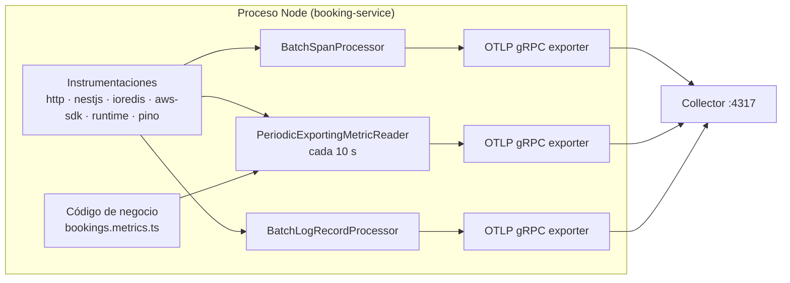

- **Traces:** cada span terminado va al `BatchSpanProcessor`, que los agrupa y los exporta en lotes.
- **Métricas:** los instrumentos (counters, histogramas) **acumulan en memoria**, y el `PeriodicExportingMetricReader` exporta el estado cada 10 segundos. Por eso una métrica nueva tarda unos segundos en aparecer. Es un modelo **push** (la app envía); el Prometheus clásico usa **pull** (hace *scrape* de un endpoint `/metrics`).
- **Logs:** Pino escribe el JSON en stdout, y además la instrumentación lo convierte en *log record* de OTel y lo manda por el `BatchLogRecordProcessor`.

Todo se identifica con el mismo **resource** (`service.name` = `booking-service`), y así Grafana sabe de qué servicio viene cada dato.

#### c) Propagación de contexto de punta a punta

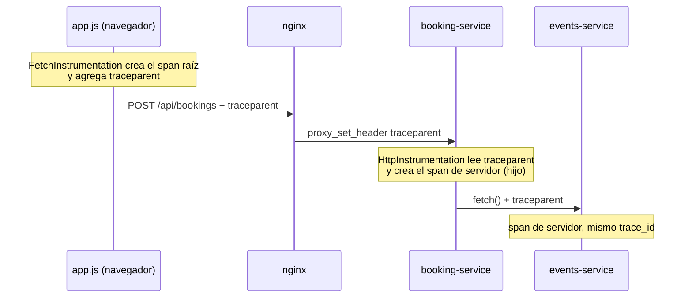

Cada salto tiene que hacer dos cosas: **extraer** el contexto que llega e **inyectarlo** en lo que sale.
- **Navegador:** `ZoneContextManager` mantiene el contexto a través de las operaciones asíncronas, y `FetchInstrumentation` inyecta `traceparent`. `propagateTraceHeaderCorsUrls: [/.*/]` habilita la inyección hacia cualquier URL.
- **nginx:** no entiende de trazas. Reenvía el header explícitamente.
- **booking-service → events-service:** la llamada usa el `fetch` nativo de Node (undici), que **no pasa por el módulo `http`**. `HttpInstrumentation` no lo ve; se necesita `@opentelemetry/instrumentation-undici` (ver la nota de 21.8).

#### d) De OTLP a Prometheus: por qué cambian los nombres

Las métricas se definen con nombres de OpenTelemetry (con puntos y una unidad) y se consultan en Prometheus con otro nombre. La traducción:

1. Los puntos pasan a guion bajo: `http.server.request.duration` → `http_server_request_duration`.
2. Se agrega la unidad como sufijo: `s` → `_seconds`, `ms` → `_milliseconds`. Las unidades entre llaves, como `{booking}`, son solo anotaciones y se descartan.
3. A los *counters* se les agrega `_total`. Si el nombre ya tenía la palabra `total`, se saca de donde estaba y queda solo al final.
4. Los histogramas se exponen como tres series: `_bucket` (con la label `le`), `_sum` y `_count`.
5. Los atributos pasan a ser labels con guion bajo: `http.route` → `http_route`, y `service.name` del resource → `service_name`.

| Nombre en OpenTelemetry (unidad) | Tipo | Nombre en Prometheus |
|---|---|---|
| `http.server.request.duration` (s) | Histograma | `http_server_request_duration_seconds_bucket` / `_sum` / `_count` |
| `bookings.created` (`{booking}`) | Counter | `bookings_created_total` |
| `bookings.total_amount` (ARS) | Counter | `bookings_amount_ARS_total` |
| `bookings.creation.duration` (ms) | Histograma | `bookings_creation_duration_milliseconds_bucket` / `_sum` / `_count` |

> **Consejo práctico:** ante la duda, buscar el nombre real en *Explore → Prometheus → Metrics browser*. La traducción depende de la versión y de la configuración del backend.

**Convenciones semánticas estables.** Las instrumentaciones HTTP de JavaScript todavía emiten por defecto los nombres viejos (`http.server.duration` en milisegundos, atributo `http.status_code`). La variable `OTEL_SEMCONV_STABILITY_OPT_IN=http` activa los **nombres estables** (`http.server.request.duration` en segundos, `http.response.status_code`, `http.route`). Los dashboards del repo usan los estables. Si se saca la variable, los paneles RED quedan vacíos: es un buen ejemplo de por qué las convenciones semánticas son un contrato.

#### e) Las métricas de negocio del repo

`bookings.metrics.ts` define tres instrumentos, y `bookings.service.ts` los registra:

| Instrumento | Tipo | Cuándo se registra | Atributos |
|---|---|---|---|
| `bookings.created` | Counter | Cuando la reserva queda guardada | `event_id`, `status=CONFIRMED` |
| `bookings.total_amount` | Counter | Ídem, suma `precio × cantidad` | `event_id`, `status=CONFIRMED` |
| `bookings.creation.duration` | Histograma | **Siempre**, en un bloque `finally` | `event_id`, `status` = `CONFIRMED` o `ERROR` |

Hay tres decisiones de diseño para discutir:
- **Contar en `finally`** hace que el histograma incluya también las reservas fallidas. El panel "Bookings con error" sale de ahí (`_count{status="ERROR"}`).
- **`event_id` es un atributo válido** porque hay pocos eventos (baja cardinalidad). `customerEmail` o `bookingId` harían explotar la cantidad de series.
- **Un counter para el revenue** permite calcular facturación por minuto con `rate()`. Un *gauge* no serviría, porque perdería el acumulado.

#### f) Logs estructurados con Pino

El mismo log sale por dos caminos:

**1. stdout (lo que muestra `docker compose logs`):** JSON de Pino, simplificado.

```json
{
  "level": 30,
  "time": 1790690000000,
  "context": "BookingsService",
  "msg": "Booking 8f3c… created for event e1",
  "trace_id": "4bf92f3577b34da6a3ce929d0e0e4736",
  "span_id": "00f067aa0ba902b7",
  "trace_flags": "01"
}
```

**2. OTLP → Loki:** la instrumentación lo convierte en un *log record* de OpenTelemetry. El mensaje pasa a ser el cuerpo (la línea en Loki). El nivel pasa a `severity_text`/`severity_number`, y `trace_id`, `span_id` y los demás campos quedan como **metadatos estructurados** asociados a la línea. Las labels indexadas son pocas (como `service_name`). Por eso se filtra primero por label y después por metadato:

```logql
{service_name="booking-service"} | trace_id="4bf92f3577b34da6a3ce929d0e0e4736"
```

- En Pino los niveles son números: 10 trace, 20 debug, 30 info, 40 warn, 50 error, 60 fatal. Es otro formato para los mismos niveles de la sección 3.1.
- `nestjs-pino` reemplaza el logger de Nest (`app.useLogger(...)`). El código sigue usando `new Logger(...)` de `@nestjs/common`, pero la salida va a Pino. `bufferLogs: true` retiene los logs del arranque hasta que Pino está listo.
- `pino-http` agrega un log por request con método, URL, status y tiempo de respuesta.

#### g) El Collector del práctico, línea por línea

| Bloque | Configuración | Por qué |
|---|---|---|
| `receivers.otlp.grpc` | `0.0.0.0:4317` | Para los servicios Node |
| `receivers.otlp.http` | `0.0.0.0:4318` + CORS `*` | Para el navegador (vía nginx) |
| `processors.resourcedetection` | `detectors: [env, system]` | Agrega `host.name` y lo que venga en `OTEL_RESOURCE_ATTRIBUTES` |
| `processors.batch` | `timeout: 5s`, `send_batch_size: 512` | Agrupa antes de reenviar |
| `exporters.otlp/lgtm` | `lgtm:4317`, `tls.insecure: true` | Reenvía todo a LGTM; sin TLS porque es una red local de Docker |
| `exporters.debug` | `verbosity: basic` | Imprime un resumen en los logs del Collector, útil para verificar que llegan datos |
| `service.pipelines` | traces, metrics, logs | Los tres con el mismo recorrido |

> **Diferencia con producción:** falta `memory_limiter` (la sección 22 lo agrega) y la CORS abierta a `*` sería inaceptable fuera de un entorno local.

### 21.5 Puesta en marcha

Requisitos: Docker y Docker Compose.

```bash
git clone https://github.com/IngSoft-ASP-2023-2/tickets-observability-node
cd tickets-observability-node
docker compose up --build -d      # ~30 s hasta que compilan los servicios Node
```

| URL | Qué es |
|---|---|
| http://localhost:8091 | Frontend |
| http://localhost:3001 | Grafana (login anónimo con rol Admin) |
| http://localhost:5001/events | API de eventos |
| http://localhost:5002/bookings/:id | API de reservas |

```bash
./scripts/load.sh 60                        # genera 60 s de tráfico
docker compose logs -f otel-collector       # ver qué recibe el Collector
docker compose down                         # bajar todo
```

### 21.6 Recorrido guiado (en clase)

**Paso 1: una traza de punta a punta.** Hacer una reserva desde http://localhost:8091. En Grafana, abrir *Dashboards → Tickets Observability → Distributed Traces*, buscar la traza y abrirla.
- Observar el waterfall `web → booking-service → events-service`, con los spans de Redis y DynamoDB como hijos.
- Identificar el root span. ¿Qué servicio lo creó? ¿Cuál es el span más largo?

**Paso 2: de la traza a los logs.** Desde un span de booking-service, usar *Logs for this span*.
- Verificar que los logs tienen el mismo `trace_id` que la traza.
- Buscar el log de `pino-http` de esa request: ¿qué información trae que el span no tiene, y al revés?

**Paso 3: métricas técnicas bajo carga.** Correr `./scripts/load.sh 60` y abrir *Service Overview (RED)*.
- Leer rate, errores y duración por servicio. ¿Por qué events-service tiene mucho más tráfico que booking-service? (Pista: mirar `scripts/load.sh`.)
- Comparar p50 contra p99. ¿Qué cuenta cada uno?
- Mirar la tabla por `http_route`: ¿por qué conviene agrupar por ruta (`/events/:id`) y no por URL (`/events/e1`)?

**Paso 4: métricas de negocio.** Abrir *Bookings (business metrics)*.
- ¿Qué evento vende más? ¿Cuánto se facturó en los últimos 15 minutos?
- Comparar el p95 de `bookings.creation.duration` con el p95 HTTP de booking-service. ¿Por qué no son iguales?
- Abrir `bookings.metrics.ts` y relacionar cada panel con su instrumento.

**Paso 5: explorar a mano.** En *Explore*, correr las consultas de ejemplo de la sección 20.4 en PromQL, LogQL y TraceQL.

**Paso 6: mirar el Collector por dentro.** Ubicar en `otel-collector-config.yaml` los bloques de la tabla de 21.4 g), y ver en `docker compose logs otel-collector` lo que imprime el exporter `debug`.

### 21.7 Ejercicios

**Ejercicio 1: extender las métricas de negocio.**
- a) En events-service, agregar un **observable gauge** `events.seats.available`, con el atributo `event_id`, que informe los cupos disponibles de cada evento leyéndolos de Redis. Sumar un panel al dashboard Bookings.
- b) En booking-service, agregar un counter `bookings.failed` con un atributo `reason` (`sold_out`, `event_not_found`, `upstream_error`).
- *Para discutir:* ¿por qué un gauge para los cupos y un counter para las reservas? ¿Qué valores de `reason` evitarían por cardinalidad?

**Ejercicio 2: span manual.** En `events.service.ts`, envolver `reserve()` en un span `reservar_cupos` con los atributos `event.id`, `reservation.quantity` y `seats.remaining`. Si no hay cupos, marcar el span con estado `ERROR` y registrar la excepción. Verificar que aparece anidado en la traza (ver el ejemplo de la sección 7).

**Ejercicio 3: romper a propósito.**
- a) `docker compose stop events-service` y hacer una reserva. ¿Cómo se ve en la traza? booking-service responde **502** (`BadGatewayException`). ¿Se mueve el error rate? ¿Y el panel "Bookings con error"?
- b) Pedir una reserva con `quantity: 50`. El `ValidationPipe` de booking-service la rechaza con **400** y la request **nunca llega a events-service**. ¿Cuántos servicios aparecen en la traza? ¿Se registra algo en `bookings.creation.duration`?
- c) Agotar un evento (por ejemplo, reservar de a 10 los 80 cupos de *Jazz Nights*, `e2`) y pedir uno más. events-service responde 400 (`Only N seats left`), pero booking-service lo transforma en **502**. ¿Es correcto que un evento agotado cuente como error de servidor? ¿Cómo lo arreglarían para que el error rate no mienta?
- d) `docker compose stop otel-collector`. ¿La aplicación sigue funcionando? ¿Qué se pierde? Relacionarlo con la discusión de `essential: true/false` de la sección 12.

**Ejercicio 4: latencia artificial.** Agregar una demora aleatoria (por ejemplo 0–800 ms en el 10 % de los casos) en `GET /events/:id`. Correr carga y ver cómo cambia el p99 mientras el p50 casi no se mueve. Encontrar una traza lenta con TraceQL (`duration > 500ms`).

**Ejercicio 5: el contrato de las convenciones semánticas.** Sacar `OTEL_SEMCONV_STABILITY_OPT_IN=http` de un servicio y reiniciarlo. ¿Qué paneles del dashboard RED dejan de mostrar ese servicio? Encontrar en *Explore* el nombre de la métrica que emite ahora. Volver a dejar la variable.

**Ejercicio 6: cambiar el destino sin tocar código.** Seguir `docs/grafana-cloud.md` con una cuenta free y activar el export doble (local + cloud). Verificar las mismas trazas en los dos lugares. ¿Qué archivos cambiaron? ¿Alguno era código de la aplicación?

**Ejercicio 7 (opcional): sampling.** Configurar `OTEL_TRACES_SAMPLER=parentbased_traceidratio` con `OTEL_TRACES_SAMPLER_ARG=0.2` en los servicios. Correr carga y comparar la cantidad de trazas en Tempo. ¿Qué pasa con las trazas que arrancan en el navegador? ¿Quién toma la decisión? ¿Cambian las métricas?

**Entregable sugerido:**
- Captura de una traza de 3 saltos con el span manual del ejercicio 2.
- Captura del panel de cupos disponibles del ejercicio 1.
- Un párrafo por cada caso del ejercicio 3 explicando qué se vio, cómo se diagnosticó con la telemetría y, en el caso c), la propuesta de cambio.

### 21.8 Nota para el docente: propagación entre booking-service y events-service

`event-client.ts` llama a events-service con el `fetch` nativo de Node, y `initObservability()` registra `HttpInstrumentation`, que **no intercepta `fetch`** porque está implementado con undici. Lo probé con el SDK de la misma versión que el repo (`sdk-node 0.222`):

- **Solo con `HttpInstrumentation`:** events-service recibe la request **sin `traceparent`**, y quedan **dos trazas separadas**.
- **Agregando `UndiciInstrumentation`:** el header llega y todo queda en **una sola traza**, con el span cliente de booking-service como padre del span servidor de events-service.

El arreglo es una línea en `libs/observability/src/index.ts` (más la dependencia `@opentelemetry/instrumentation-undici`):

```typescript
import { UndiciInstrumentation } from '@opentelemetry/instrumentation-undici';
// ...
instrumentations: [
  new HttpInstrumentation(),
  new UndiciInstrumentation(),   // fetch nativo de Node
  // ...
],
```

También sirve como ejercicio de diagnóstico: *"la traza muestra web → booking-service pero no llega a events-service; encontrar la causa"*. Enseña que la propagación depende de que **cada cliente HTTP** esté instrumentado.

### 21.9 Antecedentes: prácticos de ediciones anteriores

La presentación original usaba el repo `asp-aws-tsnode-dynamo`, con el agente propietario de New Relic. Sirve para comparar los dos enfoques de instrumentación:

| Demo | Tema | Rama |
|---|---|---|
| Práctico CloudWatch | Logging con Winston en Node.js hacia CloudWatch Logs | [feature/o11y-logs](https://github.com/IngSoft-ASP-2023-2/asp-aws-tsnode-dynamo/tree/feature/o11y-logs) |
| Práctico New Relic APM | Agente de New Relic, APM y trazas | [feature/o11y-newrelic](https://github.com/IngSoft-ASP-2023-2/asp-aws-tsnode-dynamo/tree/feature/o11y-newrelic) |
| Práctico de métricas | Métricas custom y dashboards en New Relic | [feature/o11y-newrelic-v2](https://github.com/IngSoft-ASP-2023-2/asp-aws-tsnode-dynamo/tree/feature/o11y-newrelic-v2) |

> **Para discutir:** en `asp-aws-tsnode-dynamo` la instrumentación depende de New Relic; en `tickets-observability-node` depende solo de OpenTelemetry. ¿Cuánto trabajo implicaría mandar la telemetría de cada uno a Datadog?

---

## 22. Cierre: cómo sería llevarlo a ECS

> Este apartado no se hace en clase. Muestra qué cambia cuando el práctico sale de la máquina local y se despliega en AWS con ECS Fargate. La mecánica general (sidecar, configuración del Collector, roles de IAM) está en la sección 12; acá se aplica a este sistema concreto.

### 22.1 De docker compose a AWS

| Local (`docker-compose.yml`) | En AWS | Qué cambia |
|---|---|---|
| `events-service` | Servicio ECS en Fargate | Imagen en ECR; se descubre con **ECS Service Connect** |
| `booking-service` | Servicio ECS en Fargate | `EVENTS_SERVICE_URL=http://events-service:5001` vía Service Connect |
| `redis` | **Amazon ElastiCache** (Redis/Valkey) | `REDIS_URL` apunta al endpoint del clúster (`rediss://` si hay cifrado en tránsito) |
| `dynamodb-local` | **Amazon DynamoDB** | Sin `DYNAMODB_ENDPOINT` ni credenciales *dummy*: se usa el task role |
| `web` (nginx) | Servicio ECS detrás de un **ALB** | Mismo nginx; los `proxy_pass` apuntan a los nombres de Service Connect |
| `otel-collector` | **Sidecar** en cada task (o un servicio gateway) | Misma configuración, cargada desde SSM |
| `lgtm` | **Grafana Cloud** o **Amazon Managed Grafana + Managed Prometheus + X-Ray** | Solo cambian los exporters del Collector |
| `restart: unless-stopped` | Lo resuelve ECS | Health checks del contenedor y del target group del ALB |

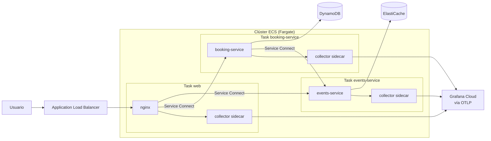

### 22.2 El Collector: la decisión más interesante

**Opción A: sidecar por task (la de la sección 12).** Cada task lleva su Collector y la app exporta a `localhost:4317`. Hay un detalle propio de este sistema: las trazas del navegador. En local, nginx las reenvía a `otel-collector:4318`. En ECS, el browser no puede llegar al sidecar de otra task. La solución natural es darle un sidecar a la task de `web` y cambiar el proxy a `http://localhost:4318/`, sin tocar el frontend.

**Opción B: Collector gateway.** Un servicio ECS aparte con uno o más Collectors, al que todos exportan por Service Connect (`http://otel-collector:4317`). Se parece más al `docker-compose` actual, centraliza la configuración y habilita el tail sampling (sección 13). A cambio, es un servicio más para operar y escalar.

**¿Qué imagen?** La del repo (`otel/opentelemetry-collector-contrib`) funciona igual en ECS. **ADOT** conviene si se quiere exportar a X-Ray o CloudWatch con soporte de AWS.

**Destino recomendado para este práctico: Grafana Cloud.** El exporter `otlp/cloud` ya está en el repo. El token no va en texto plano: se guarda en **SSM Parameter Store** o **Secrets Manager** y se inyecta como `secrets` en el contenedor del Collector (`GRAFANA_CLOUD_AUTH`).

Configuración del Collector para ECS (misma estructura que la del repo):

```yaml
receivers:
  otlp:
    protocols:
      grpc: { endpoint: 0.0.0.0:4317 }
      http: { endpoint: 0.0.0.0:4318 }

processors:
  memory_limiter:
    check_interval: 1s
    limit_percentage: 80
    spike_limit_percentage: 25
  resourcedetection:
    detectors: [env, ecs]        # en local era [env, system]
  batch:
    timeout: 5s

exporters:
  otlp/cloud:
    endpoint: ${env:GRAFANA_CLOUD_OTLP_ENDPOINT}
    headers:
      authorization: Basic ${env:GRAFANA_CLOUD_AUTH}

service:
  pipelines:
    traces:  { receivers: [otlp], processors: [memory_limiter, resourcedetection, batch], exporters: [otlp/cloud] }
    metrics: { receivers: [otlp], processors: [memory_limiter, resourcedetection, batch], exporters: [otlp/cloud] }
    logs:    { receivers: [otlp], processors: [memory_limiter, resourcedetection, batch], exporters: [otlp/cloud] }
```

> Diferencias con el archivo local: se agrega `memory_limiter` (en producción es obligatorio), el detector `ecs` agrega cluster, task y ARN a toda la telemetría, y sale el exporter a LGTM.

### 22.3 Task definition de booking-service (esquema)

```json
{
  "family": "tickets-booking-service",
  "requiresCompatibilities": ["FARGATE"],
  "networkMode": "awsvpc",
  "cpu": "512",
  "memory": "1024",
  "executionRoleArn": "arn:aws:iam::<account>:role/ticketsTaskExecutionRole",
  "taskRoleArn": "arn:aws:iam::<account>:role/ticketsBookingTaskRole",
  "containerDefinitions": [
    {
      "name": "otel-collector",
      "image": "otel/opentelemetry-collector-contrib:<versión fija>",
      "essential": true,
      "command": ["--config=env:OTEL_COLLECTOR_CONFIG"],
      "environment": [
        { "name": "GRAFANA_CLOUD_OTLP_ENDPOINT", "value": "https://otlp-gateway-prod-us-east-0.grafana.net/otlp" }
      ],
      "secrets": [
        { "name": "OTEL_COLLECTOR_CONFIG", "valueFrom": "arn:aws:ssm:us-east-1:<account>:parameter/tickets/otel/collector-config" },
        { "name": "GRAFANA_CLOUD_AUTH", "valueFrom": "arn:aws:ssm:us-east-1:<account>:parameter/tickets/otel/grafana-cloud-auth" }
      ],
      "logConfiguration": { "logDriver": "awslogs", "options": { "awslogs-group": "/ecs/tickets/otel-collector", "awslogs-region": "us-east-1", "awslogs-stream-prefix": "booking" } }
    },
    {
      "name": "booking-service",
      "image": "<account>.dkr.ecr.us-east-1.amazonaws.com/tickets-booking-service:<tag>",
      "essential": true,
      "portMappings": [{ "name": "booking-service", "containerPort": 5002, "protocol": "tcp" }],
      "environment": [
        { "name": "BOOKING_PORT", "value": "5002" },
        { "name": "AWS_REGION", "value": "us-east-1" },
        { "name": "BOOKINGS_TABLE", "value": "Bookings" },
        { "name": "EVENTS_SERVICE_URL", "value": "http://events-service:5001" },
        { "name": "OTEL_EXPORTER_OTLP_ENDPOINT", "value": "http://localhost:4317" },
        { "name": "OTEL_SEMCONV_STABILITY_OPT_IN", "value": "http" },
        { "name": "NODE_ENV", "value": "production" }
      ],
      "dependsOn": [{ "containerName": "otel-collector", "condition": "START" }],
      "logConfiguration": { "logDriver": "awslogs", "options": { "awslogs-group": "/ecs/tickets/booking-service", "awslogs-region": "us-east-1", "awslogs-stream-prefix": "app" } }
    }
  ]
}
```

- `--config=env:OTEL_COLLECTOR_CONFIG` hace que el Collector lea su YAML desde una variable de entorno, inyectada desde SSM. Con ADOT, el equivalente es `AOT_CONFIG_CONTENT` (sección 12).
- La task de events-service es análoga, con `REDIS_URL` apuntando a ElastiCache.
- La imagen mantiene el mismo `CMD` (`npm start` → `node -r ./dist/bootstrap.js dist/main.js`): el preload de OpenTelemetry no cambia por estar en ECS.
- `OTEL_SEMCONV_STABILITY_OPT_IN=http` tiene que viajar también, o los dashboards dejan de encontrar las métricas HTTP (sección 21.4 d).
- El `name` del `portMappings` es el que usa Service Connect para publicar `events-service:5001` y `booking-service:5002`.

### 22.4 Cambios necesarios en el código y la configuración

1. **Cliente de DynamoDB.** `dynamodb.client.ts` hoy siempre pasa `endpoint` y credenciales, con `'dummy'` como valor por defecto. En ECS eso rompe: hay que pasarlos **solo si están definidos**, para que el AWS SDK tome las credenciales del task role.
   ```typescript
   const raw = new DynamoDBClient({
     region: process.env.AWS_REGION ?? 'us-east-1',
     ...(process.env.DYNAMODB_ENDPOINT && { endpoint: process.env.DYNAMODB_ENDPOINT }),
   });
   ```
   En local, las credenciales *dummy* siguen llegando por las variables `AWS_ACCESS_KEY_ID` / `AWS_SECRET_ACCESS_KEY` del compose.
2. **Creación de la tabla.** booking-service crea `Bookings` al arrancar. En AWS la tabla se define como infraestructura (CloudFormation, CDK o Terraform), y el servicio solo necesita leer y escribir.
3. **Redis.** Si ElastiCache tiene cifrado en tránsito, `REDIS_URL` pasa a `rediss://...`. ioredis lo soporta sin cambios de código.
4. **nginx.** Los `proxy_pass` pasan a los nombres de Service Connect, y `/otel/` al sidecar de la propia task (`http://localhost:4318/`).
5. **Logs.** Por OTLP llegan a Grafana Cloud correlacionados con las trazas. Además, stdout va a CloudWatch Logs con el driver `awslogs`, que sirve de respaldo si el Collector falla.
6. **Imágenes.** Fijar versiones (`node:20-alpine` con digest y el Collector con una versión concreta, no `latest`) y publicarlas en ECR.
7. **Dashboards.** El provisioning por volumen es solo para local. En Grafana Cloud se importan los mismos JSON de `grafana/dashboards/`. Puede hacer falta ajustar nombres de labels en las queries, porque Grafana Cloud mapea los atributos de recurso de forma levemente distinta.

### 22.5 Permisos IAM

| Rol | Qué necesita |
|---|---|
| **Task execution role** (compartido) | Bajar imágenes de ECR, escribir en CloudWatch Logs, `ssm:GetParameters` sobre `/tickets/otel/*` (y `kms:Decrypt` si el parámetro es `SecureString`) |
| **Task role de booking-service** | `dynamodb:PutItem` y `dynamodb:GetItem` sobre la tabla `Bookings` |
| **Task role de events-service** | Nada de AWS para Redis: el acceso a ElastiCache se controla con *security groups* (y AUTH/IAM auth de Redis si se habilita) |
| **Si se exporta a X-Ray / CloudWatch** | `xray:PutTraceSegments`, `xray:PutTelemetryRecords`, `cloudwatch:PutMetricData`, `logs:PutLogEvents` en el task role de cada task con sidecar |

> Con Grafana Cloud como destino, **el Collector no necesita permisos de AWS**: se autentica con el token. Es una diferencia concreta con la variante X-Ray de la sección 12.

### 22.6 Checklist del despliegue

- [ ] Imágenes de `events-service`, `booking-service` y `web` en ECR, con tags fijos
- [ ] Tabla `Bookings` en DynamoDB y clúster de ElastiCache creados como infraestructura como código
- [ ] Cliente de DynamoDB sin endpoint ni credenciales fijas
- [ ] Config del Collector y token de Grafana Cloud en SSM
- [ ] Namespace de Service Connect y los tres servicios registrados
- [ ] ALB apuntando al servicio `web`, con health check
- [ ] nginx con `/otel/` apuntando al sidecar local
- [ ] Roles de IAM de ejecución y de cada task
- [ ] Dashboards importados en Grafana Cloud
- [ ] Prueba final: una reserva desde el navegador genera una traza `web → booking-service → events-service` en Grafana Cloud, con metadatos de ECS en los atributos de recurso

### 22.7 Para pensar

- ¿Sidecar por task o gateway? ¿Cambia la respuesta si después se quiere tail sampling?
- Si el Collector de la task de booking-service muere, ¿conviene que ECS reinicie toda la task (`essential: true`)?
- ¿Qué cambiaría en la sección 22.2 si el destino fuera X-Ray en lugar de Grafana Cloud? ¿Qué parte del código de la aplicación cambiaría? (Respuesta esperada: ninguna.)

---

## 23. Bibliografía

### Libros principales

- **Newman, S.** (2021). *Building Microservices: Designing Fine-Grained Systems* (2.ª ed.). O'Reilly Media. — Capítulo 10, "From Monitoring to Observability". Fuente de la frase de apertura de la clase.
- **Majors, C., Fong-Jones, L. y Miranda, G.** (2022). *Observability Engineering: Achieving Production Excellence*. O'Reilly Media. — La referencia conceptual sobre observabilidad moderna, eventos de alta cardinalidad y diferencias con el monitoreo.
- **Parker, A., Young, T.** (2024). *Learning OpenTelemetry: Setting Up and Operating a Modern Observability System*. O'Reilly Media. — Escrito por miembros del proyecto OpenTelemetry; cubre SDK, Collector y estrategias de adopción.
- **Beyer, B., Jones, C., Petoff, J. y Murphy, N. R.** (Eds.). (2016). *Site Reliability Engineering: How Google Runs Production Systems*. O'Reilly Media. — Capítulo 6, "Monitoring Distributed Systems" (las cuatro *golden signals*). [Gratis online](https://sre.google/sre-book/table-of-contents/).
- **Beyer, B., Murphy, N. R., Rensin, D. K., Kawahara, K. y Thorne, S.** (Eds.). (2018). *The Site Reliability Workbook: Practical Ways to Implement SRE*. O'Reilly Media. — Capítulos sobre implementación de SLOs y alertas basadas en SLOs. [Gratis online](https://sre.google/workbook/table-of-contents/).

### Lectura complementaria

- **Sridharan, C.** (2018). *Distributed Systems Observability*. O'Reilly Media. — Reporte breve y accesible sobre los tres pilares; ideal como primera lectura para estudiantes.
- **Shkuro, Y.** (2019). *Mastering Distributed Tracing*. Packt. — Del creador de Jaeger; tracing en profundidad, propagación de contexto y sampling.
- **Boten, A.** (2022). *Cloud-Native Observability with OpenTelemetry*. Packt. — Enfoque práctico con ejemplos de código y del Collector.
- **Hidalgo, A.** (2020). *Implementing Service Level Objectives*. O'Reilly Media. — Cómo definir SLIs y SLOs útiles.
- **Nygard, M. T.** (2018). *Release It! Design and Deploy Production-Ready Software* (2.ª ed.). Pragmatic Bookshelf. — Patrones de estabilidad (timeouts, *circuit breaker*, *bulkheads*) y transparencia del sistema. Complementa el caso del checkout lento.
- **Gregg, B.** (2020). *Systems Performance: Enterprise and the Cloud* (2.ª ed.). Addison-Wesley. — Método USE y análisis de rendimiento a nivel sistema.
- **Gregg, B.** (2019). *BPF Performance Tools*. Addison-Wesley. — Base de la observabilidad con eBPF.

### Papers y artículos fundacionales

- **Sigelman, B. H. et al.** (2010). *Dapper, a Large-Scale Distributed Systems Tracing Infrastructure*. Google Technical Report dapper-2010-1. — El origen del tracing distribuido moderno. https://research.google/pubs/dapper-a-large-scale-distributed-systems-tracing-infrastructure/
- **Dam, J.** (2018). *The RED Method: How to Instrument Your Services* (sobre el método propuesto por Tom Wilkie). Grafana Labs. https://grafana.com/blog/2018/08/02/the-red-method-how-to-instrument-your-services/
- **Gregg, B.** *The USE Method*. https://www.brendangregg.com/usemethod.html
- **Ewaschuk, R.** *My Philosophy on Alerting*. Google. — Base del principio "alertar sobre síntomas, no sobre causas". Incluido en el SRE Book, cap. 6.

---

## 24. Referencias

### OpenTelemetry
- Documentación oficial: https://opentelemetry.io/docs/
- Collector — configuración: https://opentelemetry.io/docs/collector/configuration/
- Patrones de despliegue del Collector: https://opentelemetry.io/docs/collector/deployment/
- Convenciones semánticas: https://opentelemetry.io/docs/specs/semconv/
- Especificación de logs y *log bridges*: https://opentelemetry.io/docs/specs/otel/logs/
- Sampling: https://opentelemetry.io/docs/concepts/sampling/
- OpenTelemetry para Node.js: https://opentelemetry.io/docs/languages/js/getting-started/nodejs/
- OpenTelemetry en el navegador: https://opentelemetry.io/docs/languages/js/getting-started/browser/
- W3C Trace Context: https://www.w3.org/TR/trace-context/

### AWS
- AWS Distro for OpenTelemetry: https://aws-otel.github.io/docs/introduction
- ADOT en ECS: https://aws-otel.github.io/docs/setup/ecs
- ¿Qué es Amazon CloudWatch Logs?: https://docs.aws.amazon.com/AmazonCloudWatch/latest/logs/WhatIsCloudWatchLogs.html
- CloudWatch Logs Insights: https://docs.aws.amazon.com/AmazonCloudWatch/latest/logs/AnalyzingLogData.html
- Logs de entornos Elastic Beanstalk: https://docs.aws.amazon.com/elasticbeanstalk/latest/dg/environments-cfg-logging.html
- AWS X-Ray: https://docs.aws.amazon.com/xray/latest/devguide/aws-xray.html
- ECS Service Connect: https://docs.aws.amazon.com/AmazonECS/latest/developerguide/service-connect.html
- Secretos en ECS desde SSM / Secrets Manager: https://docs.aws.amazon.com/AmazonECS/latest/developerguide/specifying-sensitive-data.html

### Logging
- *What Is Structured Logging and Why Developers Need It* — Stackify: https://stackify.com/what-is-structured-logging-and-why-developers-need-it/
- *Logging agents vs. logging libraries: which should you use?* — Mezmo: https://www.mezmo.com/blog/logging-agents-vs-logging-libraries-which-should-you-use
- Agente o biblioteca cliente — Google Cloud Logging: https://cloud.google.com/logging/docs/agent-or-library?hl=es
- *Log ecosystem overview* — Parseable: https://www.parseable.com/blog/log-ecosystem-overview
- Elastic Stack: https://www.elastic.co/elastic-stack
- Winston (Node.js): https://github.com/winstonjs/winston

### APM y tracing distribuido
- *Quick Introduction to Distributed Tracing* — New Relic (ebook): https://newrelic.com/resources/ebooks/quick-introduction-distributed-tracing
- *What is Distributed Tracing?* — Datadog Knowledge Center: https://www.datadoghq.com/knowledge-center/distributed-tracing/
- New Relic y OpenTelemetry: https://docs.newrelic.com/docs/opentelemetry/opentelemetry-introduction/
- Apache SkyWalking: https://skywalking.apache.org/
- Jaeger: https://www.jaegertracing.io/

### Visualización y stack abierto
- Grafana — documentación: https://grafana.com/docs/
- Prometheus: https://prometheus.io/docs/introduction/overview/
- Grafana Tempo: https://grafana.com/docs/tempo/latest/
- Grafana Loki: https://grafana.com/docs/loki/latest/
- Imagen `grafana/otel-lgtm`: https://github.com/grafana/docker-otel-lgtm
- Grafana Cloud — envío de datos por OTLP: https://grafana.com/docs/grafana-cloud/send-data/otlp/

### Herramientas del práctico
- Docker Compose: https://docs.docker.com/compose/
- NestJS: https://docs.nestjs.com/
- Redis: https://redis.io/docs/latest/ · ioredis: https://github.com/redis/ioredis
- DynamoDB Local: https://docs.aws.amazon.com/amazondynamodb/latest/developerguide/DynamoDBLocal.html
- AWS SDK for JavaScript v3: https://docs.aws.amazon.com/sdk-for-javascript/v3/developer-guide/
- nginx como proxy reverso: https://docs.nginx.com/nginx/admin-guide/web-server/reverse-proxy/
- Pino: https://getpino.io/ · nestjs-pino: https://github.com/iamolegga/nestjs-pino
- Instrumentaciones de OpenTelemetry para JS (pino, undici, ioredis, aws-sdk, nestjs-core): https://github.com/open-telemetry/opentelemetry-js-contrib
- Convenciones semánticas HTTP y migración a las estables: https://opentelemetry.io/docs/specs/semconv/http/
- Compatibilidad OpenTelemetry ↔ Prometheus (traducción de nombres): https://opentelemetry.io/docs/specs/otel/compatibility/prometheus_and_openmetrics/
- PromQL: https://prometheus.io/docs/prometheus/latest/querying/basics/
- LogQL: https://grafana.com/docs/loki/latest/query/
- TraceQL: https://grafana.com/docs/tempo/latest/traceql/
- Provisioning de Grafana: https://grafana.com/docs/grafana/latest/administration/provisioning/

### SRE
- Google SRE: https://sre.google/
- *Monitoring Distributed Systems* (SRE Book, cap. 6): https://sre.google/sre-book/monitoring-distributed-systems/

### Material del curso
- Práctico `tickets-observability-node`: https://github.com/IngSoft-ASP-2023-2/tickets-observability-node
- Práctico original en .NET: https://github.com/nfornaro/tickets-observability
- Prácticos anteriores (`asp-aws-tsnode-dynamo`, ramas de observabilidad): ver sección 21.9.
- Presentación original: *Observability* — Arquitectura de Software en la práctica, Universidad ORT Uruguay.
